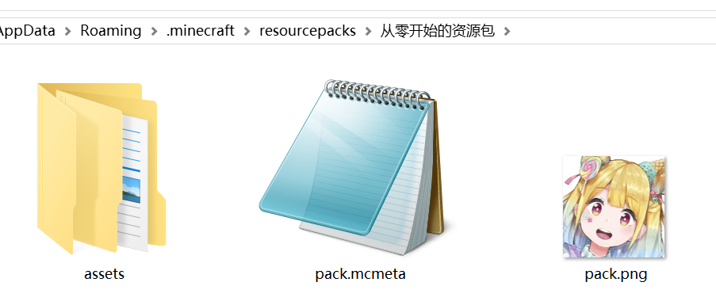
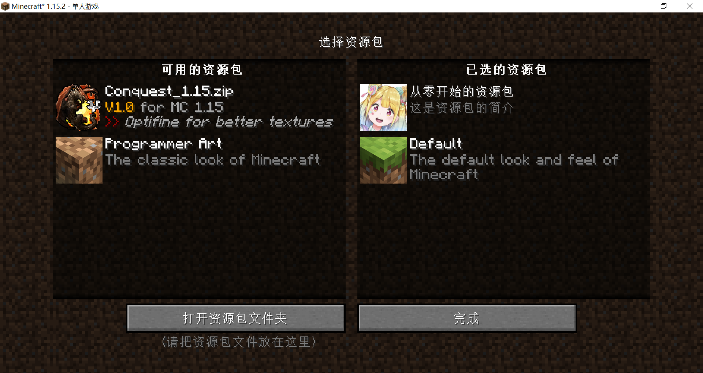

# 资源包的图标

不想用默认的资源包图标，想要换一个好看的图标？

1. 首先我们需要一个正方形的png格式图片，必需是正常保存的png格式，别的格式把后缀改成png那不叫png格式。图片的变长应为2的次方，例如16，32， 64等。

2. 然后改名为pack.png。
3. 放入资源包文件夹下。

再打开游戏的资源包界面，我们看到资源包的图标已经改成了刚刚设置的图标，一只可爱的琴吹夢！

  <Vssue/>