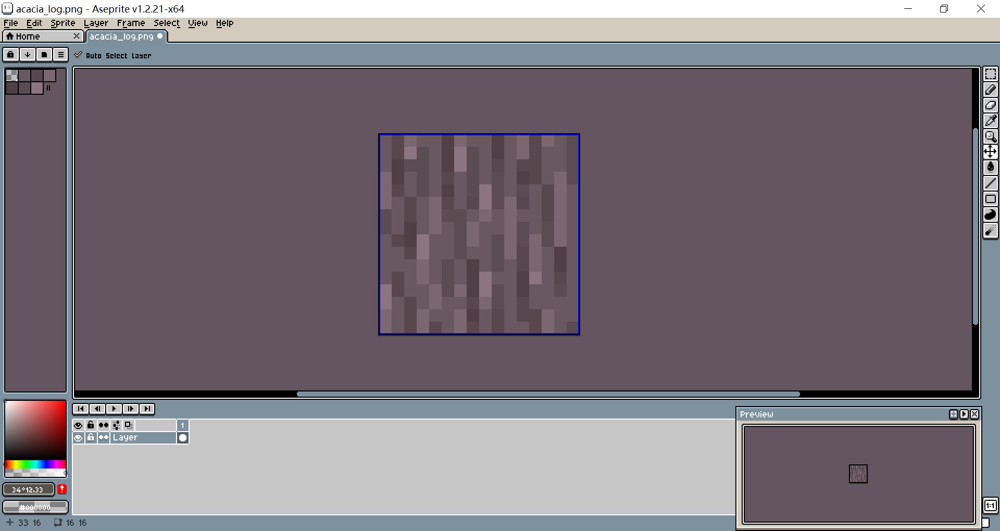

# 简单地修改一张材质

让我们打开assets/minecraft/textures/block，然后找到我们要修改的材质，这里我们选择了acacia_log.png。

::: tip

如果你实际看到的路径是assets/minecraft/textures/blocks，别担心，Minecraft的不同版本的资源路径并不相同，用你实际看到的路径即可。

:::

打开图片编辑器，对其修改一番，并按照原名保存，覆盖掉原先的文件。

我这里仅仅简单调了下色：

重载资源包，放出金合欢木，看看修改后的材质吧！

::: details 阶段小结

到现在为止，如果你有一定的美术基础，已经可以做出一款不错的材质包了，前面的虽然是最最基础的内容，却也是最有用的内容。

但既然资源包可以实现许许多多的内容，何必束手束脚的呢？看看conquest、cocricot、ITP等诸多资源包，它们所做到的显然不是改改材质就能实现的。

如果你有很多想法苦于不知道怎么实现，继续看下去吧，学习愉快！

:::

  <Vssue/>