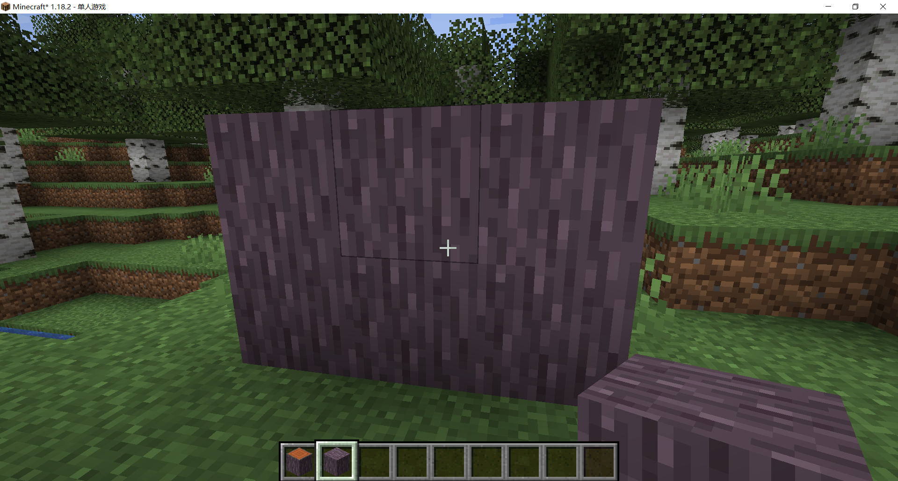

# 简单地修改一张纹理

打开 assets/minecraft/textures/block，找到要修改的纹理，这里我选择了 acacia_log.png。

::: tip

在 1.12 以及之前的版本的路径可能是 assets/minecraft/textures/blocks，Minecraft 不同版本的资源路径并不相同，用你实际看到的路径即可。

:::

打开图片编辑器，对其修改一番，并按照原名保存，覆盖掉原先的文件。

我仅仅改了下色调：

重载资源包，放出金合欢木，看看修改后的纹理吧！

