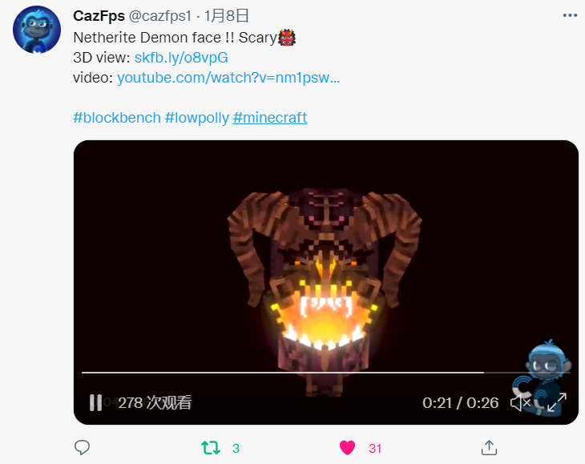

# 【森罗万象新闻篇】2021年1月上半月刊

【森罗万象新闻篇】持续为各位带来资源包相关资讯。每月10日，25日前后更新！

不仅仅是资源包，让MC变得更具美感的一切都可能出现在这里。所以你也能看到光影、建模软件、装饰类模组、甚至是建筑的相关资讯。

## 社区事件

### Continuum 社区摄影比赛

> [推文](https://twitter.com/ContinuumGfx/status/1469525480026292226)|[Discord](https://discord.com/invite/aAAMDBa)

上个月 Continuum Discord 社区举办了一场截图比赛，选出了三名优胜和三名亚军。

::: details 优胜作品展示

优胜之一推文链接：[https://twitter.com/ContinuumGfx/status/1475540275699372034](https://twitter.com/ContinuumGfx/status/1475540275699372034)

优胜之二推文链接：[https://twitter.com/ContinuumGfx/status/1476357726825504768](https://twitter.com/ContinuumGfx/status/1476357726825504768)

优胜之三推文链接：[https://twitter.com/ContinuumGfx/status/1477059427291312135](https://twitter.com/ContinuumGfx/status/1477059427291312135)

:::

### Blockbench 插件 Animated Java 发布

> [GitHub](https://github.com/Animated-Java/animated-java)|[教程（MCBBS）](https://www.mcbbs.net/thread-1289868-1-1.html)|[展示视频（B站）](https://www.bilibili.com/video/BV12D4y1F7VM)

以下介绍来源于MCBBS的教程帖：

Animated Java（以下简称为**AJ**）是建模软件blockbench的其中一个插件，由FetchBot与SnaveSutit自2020年九月开始开发。它能够将基岩模型和动画转换为java版的数据包和资源包以便在游戏中调用。此插件不会替代原版的实体或模型，插件的主要目的是服务地图创作者。今年一月四号凌晨的时候AJ放出了公开的beta版本，现在已经能够在blockbench内置的插件列表中搜索到该插件。

展示视频：

::: bv 12D4y1F7VM

:::

## 作品更新

### Mizuno's 16 Craft 更新 1.18.1

> [官网更新日志](https://mizunomcmemo.blogspot.com/2022/01/mizunos-16-craft-java-edition-1181.html)

### Sildur 光影更新

> [推文](https://twitter.com/Sildurs_shaders/status/1477351383162576907)|[官网](https://sildurs-shaders.github.io/)|[MinecraftForum](https://www.minecraftforum.net/forums/mapping-and-modding-java-edition/minecraft-mods/1291396-1-7-10-1-18-1-sildurs-shaders-pc-mac-intel)|[CurseForge](https://www.curseforge.com/minecraft/customization/sildurs-vibrant-shaders)|[MCBBS搬运帖](https://www.mcbbs.net/thread-860071-1-1.html)

（澄清一下，Sildur's Shaders，无论是 Vibrant 还是 Enhanced Default 都**不是**光追光影，Sildur 本人也从未声称过他的作品用了 ray tracing 技术）

### MiniaTuria 发布汽车模型包

> [推文](https://twitter.com/bisukko_m/status/1477956423917391876)|[官网（可直连）](https://miniaturia.club/mt-special-cars/)

## 创作前瞻

### FreshAnimation 的作者展示了奔跑的马儿

> [推文](https://twitter.com/Fresh_LX/status/1471385151766630401)|[CurseForge](https://www.curseforge.com/minecraft/texture-packs/fresh-animations)|[MCBBS搬运帖](https://www.mcbbs.net/thread-1285936-1-1.html)

.gif)

### Chichi在Twitter上展示新创作的物品纹理

> [推文](https://twitter.com/_ChichiPixels/status/1478535465464696832)

::: details 更多图片

推文链接：[https://twitter.com/_ChichiPixels/status/1478842847377989641](https://twitter.com/_ChichiPixels/status/1478842847377989641)

推文链接：[https://twitter.com/_ChichiPixels/status/1479194627337068552](https://twitter.com/_ChichiPixels/status/1479194627337068552)

推文链接：[https://twitter.com/_ChichiPixels/status/1479570297460301824](https://twitter.com/_ChichiPixels/status/1479570297460301824)

推文链接：[https://twitter.com/_ChichiPixels/status/1479962162248486919](https://twitter.com/_ChichiPixels/status/1479962162248486919)

推文链接：[https://twitter.com/_ChichiPixels/status/1480324661393211396](https://twitter.com/_ChichiPixels/status/1480324661393211396)

:::

### Nitgo正在为Pixel Tree纹理包绘制生物纹理

> [推文](https://twitter.com/Nitgo_/status/1479882448402059271)|[PlanetMinecraft](https://www.planetminecraft.com/texture-pack/pixel-tree-a-world-of-wonders/)

::: details 更多图片

推文链接：[https://twitter.com/Nitgo_/status/1470480459654221826](https://twitter.com/Nitgo_/status/1470480459654221826)

推文链接：[https://twitter.com/Nitgo_/status/1458923607875362816](https://twitter.com/Nitgo_/status/1458923607875362816)

:::

### Continuum Graphics 展示了 Stratum 纹理包的蛛网

> [推文](https://twitter.com/ContinuumGfx/status/1479548357957885952)|[官网](https://continuum.graphics/stratum-resourcepack/)

## 新作推荐

### CRISPY CABIN 16x纹理

> [推文](https://twitter.com/CornCobDog/status/1474666317777031168)|[PlanetMinecraft](https://www.planetminecraft.com/texture-pack/crispy-cabin-v1-0-0-release/)|[展示视频（Youtube）](https://www.youtube.com/watch?v=1dsrj3tLWCs)

2021年12月25日，CornCobDog发布了16x纹理包CRISPY CABIN v1.0.0

::: details 更多图片

:::

### Ikuyuk 的帽子 CIT 资源包

> [推文](https://twitter.com/ikuyuk_/status/1479325173392166912)|[下载链接（mediafire）](https://www.mediafire.com/file/6l2x6vn6ct9m7ha/%255BDEMO%255D_ikuyuk%2527s-Hats.zip/file)

由于 moondropcraft 资源包还需要一段时间才能完成， ikuyuk 先发布了一款小型的 CIT 资源包， 可以把雕刻南瓜变成各种帽子（或者趴在头上的猫猫）。

::: details 更多图片

:::

## 创意分享

### Conquest Reforged 发布了建筑指南

> [推文](https://twitter.com/ConReforged/status/1478057021459116037)|[官网文章](https://conquestreforged.com/guides/gradients)

Conquest Reforged 官网在1月4日发布了一篇建筑指南，介绍了如何搭配方块实现渐变效果。

## 作品欣赏

### CazFps 的模型展示

**下界合金魔**

> [推文](https://twitter.com/cazfps1/status/1479560668198187012)|[sketchfab（可直连）](https://sketchfab.com/3d-models/netherite-devil-face-98e5a17cd0024a3b93966fe00cb6defc)

::: 更多展示

**丘比特**

> [推文](https://twitter.com/cazfps1/status/1480004787454230532)|[sketchfab（可直连）](https://sketchfab.com/3d-models/minecraft-cupid-boss-b3dfda8714a94f27b65e82838383e031)

**精灵猩猩**

> [推文](https://twitter.com/cazfps1/status/1478450459467825157)

**洞穴昆虫**

> [推文](https://twitter.com/cazfps1/status/1477425871145377793)|[sketchfab（可直连）](https://sketchfab.com/3d-models/cave-insect-9ea7f2f021a54c699392ef64c686d8e0)

:::

### は的茄子城

> [推文](https://twitter.com/sub_nasa/status/1478396396680396800)

は制作的茄子城天守阁，使用了 MiniaTuria

**天守阁**

::: dedails 更多展示

**金𩾇**（日本天守阁正脊端部的装饰）

**本丸**

**神社**

:::
