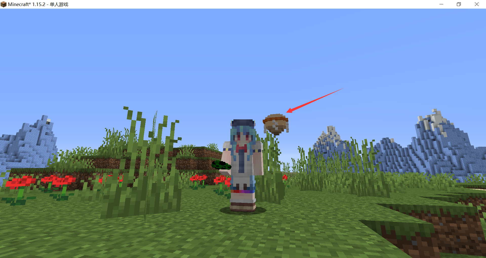
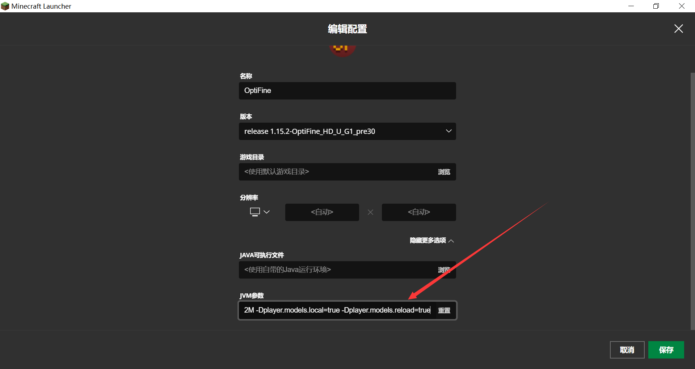
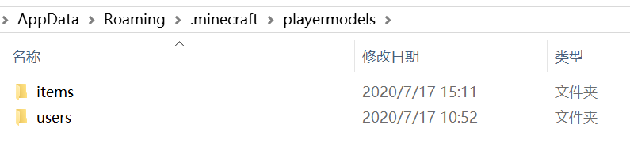
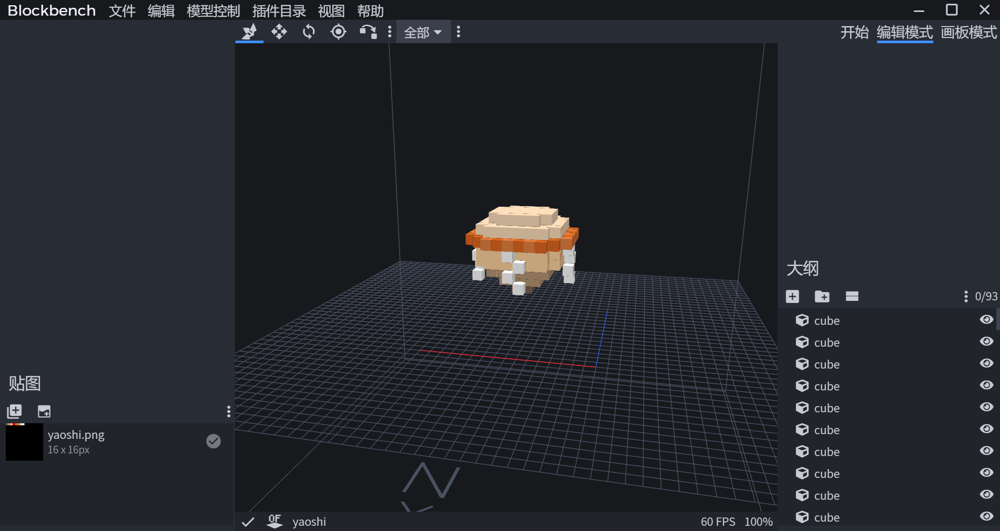
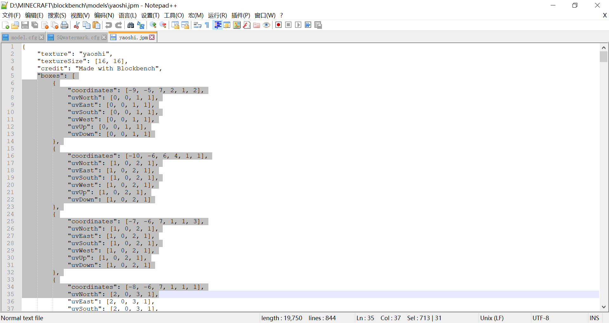
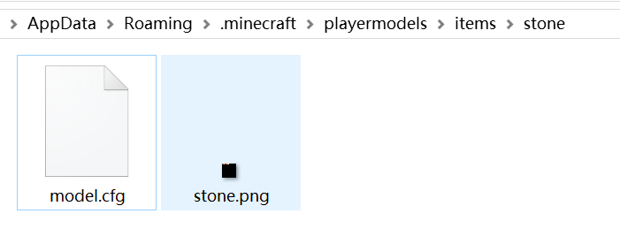
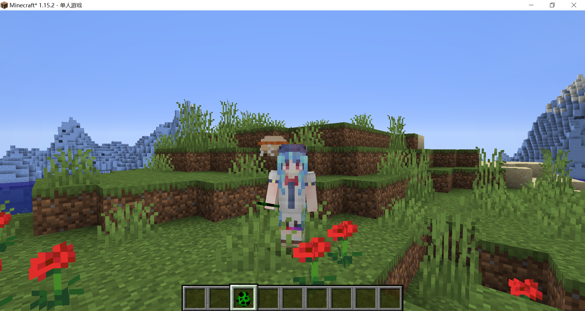
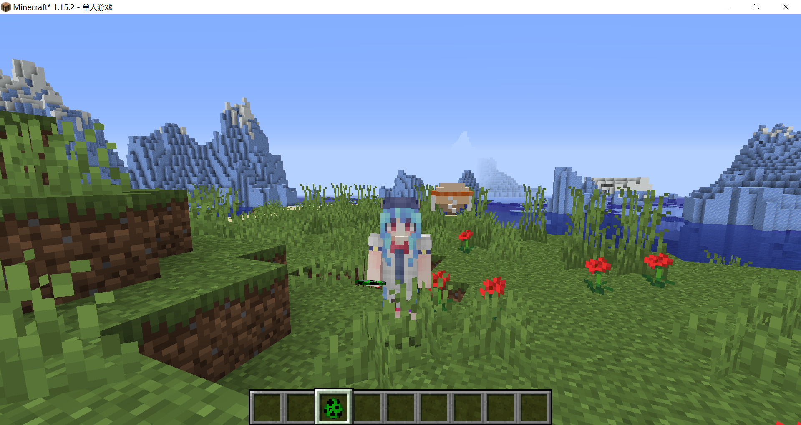
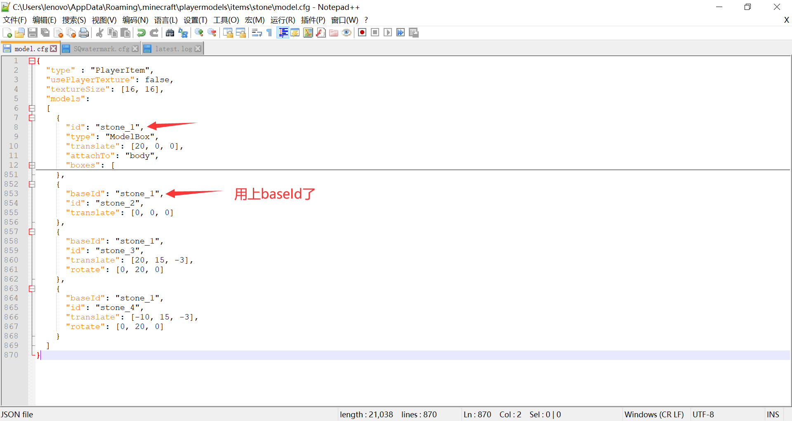
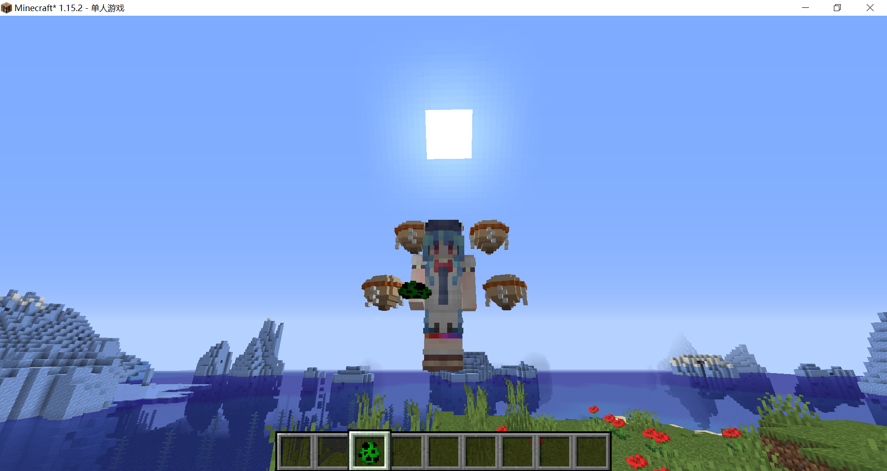

# 自定义玩家模型

> 示例用天子皮肤是几何的作品，[发布帖](https://www.mcbbs.net/thread-836920-1-1.html)
>
> 本章前置知识：
>
> ​	自定义实体模型

OptiFine的cem功能不包含玩家模型，但玩家模型并非不可以自定义，但是其方法有不小的区别。

::: warning

接下来的内容不属于严格意义上的资源包，甚至和resourcepacks文件夹没有任何关系。请酌情阅读。

:::

本节我们要在比那名居天子的旁边加上一块漂浮的要石：



## 设置JVM启动参数

第一步，~~换上天子的皮肤~~，在游戏JVM参数中添加以下两个配置，并启动游戏。

```
-Dplayer.models.local=true -Dplayer.models.reload=true
```

上面这两个配置的第一个用于开启自定义玩家模型功能，第二个用于每五秒刷新一次模型以便测试。平时使用时，只需要添加第一个参数，测试模型时把第二个也加上吧。



## 制作模型

在.minecraft文件夹下新建名为playermodels的文件夹，然后在playermodels文件夹里新建items文件夹和users文件夹，其中items文件夹用于存放模型和材质，users文件加用于存放玩家信息。



因为我们要制作的是一块石头的模型，在items文件夹内新建文件夹名为stone，在stone文件夹内新建文本文件，命名为model.cfg，这本质上也是一个json格式的文件。这个文件包含有关模型的全部信息。

**model.cfg**

```json
{
  // 这不是一个有效的配置文件，仅用于讲解概念
  "type" : "PlayerItem", // 固定的，不要改
  "usePlayerTexture": <true|false>, //是否使用玩家材质，一般填false
  "textureSize": [<width>, <height>], //材质的尺寸
  "models": //子模型列表
  [
    { //这是一个子模型
      "baseId": <parent_id>, //父类模型的id
      "id": <id>, //模型的id
      "type": "ModelBox", //固定的，不要改
      "attachTo": "<head|body|leftArm|rightArm|leftLeg|rightLeg>", //附着到哪个部位
	  "invertAxis": <axis_to_invert>, //反转轴
      "translate": [<x>, <y>, <z>], //平移
      "rotate": [<angle_x>, <angle_y>, <angle_z>], //旋转
      "mirrorTexture": <axis_to_mirror>, //镜像材质，通常不需要
      "scale": <scale>, //缩放比例，默认值为1.0
      // 部件模型的定义，详见自定义实体模型部件
      ...
    },
    ...
  ]
}
```

我们先把一些默认的值填上，以便修改：

```json
{
  // 这不是一个有效的配置文件，仅用于讲解概念
  "type" : "PlayerItem",
  "usePlayerTexture": false,
  "textureSize": [<width>, <height>], //材质的尺寸
  "models": //子模型列表
  [
    {
      //不需要继承什么父类模型，所以不填baseId
      "id": "stone",
      "type": "ModelBox", //固定的，不要改
      "attachTo": "body", //附着到身体
      "translate": [0, 0, 0], //平移量
      "rotate": [0, 0, 0], //旋转
      "scale": 1.0, //缩放比例，默认值为1.0
      // 部件模型的定义，详见自定义实体模型部件
      ...
    }
  ]
}
```

自定义玩家模型的关键部分的格式也是cem模型，所以可以用BlockBench制作jpm模型，再手动修改文件。

由于默认看这一小节的读者已经掌握了jpm模型的做法，我就不演示了。现在我有一个做好的jpm模型，是用MagicaVoxel做了体素然后用Voxel Importer插件导入Blockbench的，丑，但是能用。



我们打开jpm文件，将boxes的内容整个复制下来，粘贴到model.cfg文件中，并将textureSize给抄上。



**model.cfg**

```json
{
  // 这不是一个有效的配置文件，仅用于讲解概念
  "type" : "PlayerItem",
  "usePlayerTexture": false,
  "textureSize": [16, 16],
  "models":
  [
    {
      "id": "stone",
      "type": "ModelBox",
      "attachTo": "body",
      "translate": [0, 0, 0],
      "rotate": [0, 0, 0],
      "scale": 1.0,
      "boxes": [
		{
			"coordinates": [-9, -5, 7, 2, 1, 2],
			"uvNorth": [0, 0, 1, 1],
			"uvEast": [0, 0, 1, 1],
			"uvSouth": [0, 0, 1, 1],
			"uvWest": [0, 0, 1, 1],
			"uvUp": [0, 0, 1, 1],
			"uvDown": [0, 0, 1, 1]
		},
        ...//此处省略一大堆内容
      ]
    }
  ]
}
```

然后在model.cfg旁边放上材质，我们注意到model.cfg本身只规范了材质的大小，没写具体用什么材质，也就是说我们可以给不同的玩家用不同的模型，也可以给不同玩家用相同的模型，不同的材质。



## 使用模型

我们的素材准备好了，接下来要让具体的玩家使用上模型和材质，进入先前创建的users文件夹，新建文件名为username.cfg，username换成自己的游戏id，我的游戏id是SQwatermark，所以文件名为SQwatermark.cfg。

**username.cfg**

```json
{
  "items":
  [
    {
      "type": "stone", //type和items文件夹下的子文件夹相对应
      //"model": "<model.cfg>", //填playermodels文件夹下的路径，默认路径就是我们刚刚用的路径。
      //texture的默认路径看下面的文档，不建议用默认路径，因为默认路径的材质要命名为玩家名。
	  "texture": "items/stone/stone.png", 
      "active": true //一般填true就行了，填false就是不显示
    }
  ]
}
```

进入游戏看看效果



要石的位置还不太理想，我们调整一下model.cfg，改一下偏移值：

```json
"translate": [20, 0, 0]
```

好的，达到想要的效果了，平时使用模型时，可以把jvm参数`-Dplayer.models.reload=true`删除了。



我们再灵活地使用一下模型的继承，增加几个要石：



效果：



## 附：非官方说明文档

```
######################################################################
# Add -Dplayer.models.local=true -Dplayer.models.reload=true to your JVM arguments
# https://github.com/sp614x/optifine/blob/master/OptiFineDoc/doc/system_properties.txt
# https://github.com/sp614x/optifine/blob/master/OptiFineDoc/doc/cem_model.txt
# https://github.com/sp614x/optifine/blob/master/OptiFineDoc/doc/cem_part.txt
######################################################################
# Custom Player Model Add-on
# User Config <user>.cfg
# Located in ".minecraft/playermodels/users"
# 
# Textures can be specified as:
# 	"texture" - relative to folder ".minecraft/playermodels/"
# 	"folder/texture" - relative to folder ".minecraft/playermodels/"
# Models can be specified as:
# 	"model" - relative to folder ".minecraft/playermodels/"
# 	"folder/model" - relative to folder ".minecraft/playermodels/"
# 	
# If nothing is set for the texture it'll use ".minecraft/playermodels/items/<name set for type>/users/<user.png>"
# If nothing is set for the model it'll use ".minecraft/playermodels/items/<name set for type>/model.cfg"
######################################################################
{
  "items":
  [
    {
      "type": "<name>",						- Name of folder in ".minecraft/playermodels/items/"
	  "model": "<model.cfg>",				- Part model file, from which to load the part model definition
      "texture": "<texture.png>",			- Texture used by the model
      "active": "<true|false>"				- True: active for user, False: not active for user
    },
	...
  ]
}

######################################################################
# Custom Player Model Add-on
# User Part Model <model>.cfg
# Located in ".minecraft/playermodels/items/<name set for type>"
######################################################################
{
  "type" : "PlayerItem",
  "usePlayerTexture": <true|false>,										- Uses player texture if set to true
  "textureSize": [<width>, <height>],                                   - Texture size in pixels
  "models":                                                             - List of models
  [
    {
      "baseId": <parent_id>,                                            - Model parent ID, all parent properties are inherited
      "id": <id>,                                                       - Model ID, can be used to reference the model as parent
      "type": "ModelBox",
      "attachTo": "<head|body|leftArm|rightArm|leftLeg|rightLeg>",      - Player part to which the part model is attached
	  "invertAxis": <axis_to_invert>,                                   - Axis to invert, for example "xyz" inverts all axes
      "translate": [<x>, <y>, <z>],                                     - Translate (pixels)
      "rotate": [<angle_x>, <angle_y>, <angle_z>],                      - Rotate (degrees)
      "mirrorTexture": <axis_to_mirror>,                                - Texture axis to mirror, for example "uv" mirrors both U and V axis
      "scale": <scale>,                                                 - Render scale, default is 1.0
      # Part Model definition, see "cem_part.txt" for details           - Part model definition (inline)
      ...
    },
    ...
  ]
}
```

<br/><br/><Vssue/>