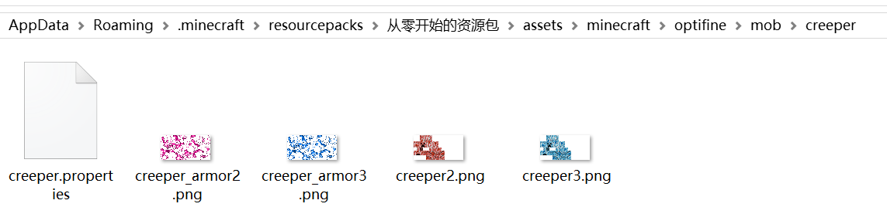
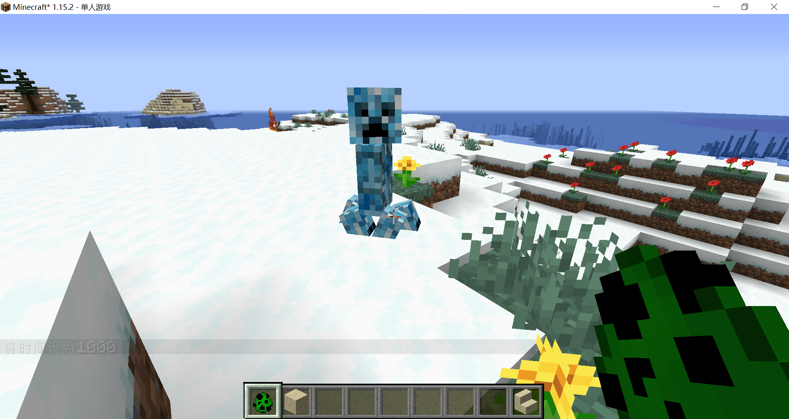
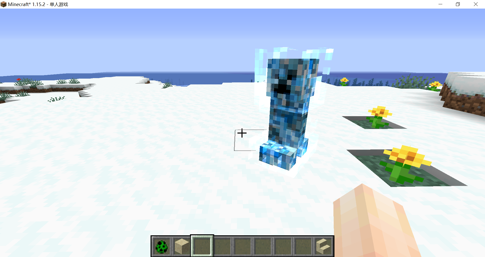
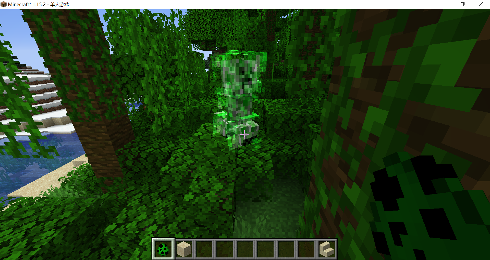
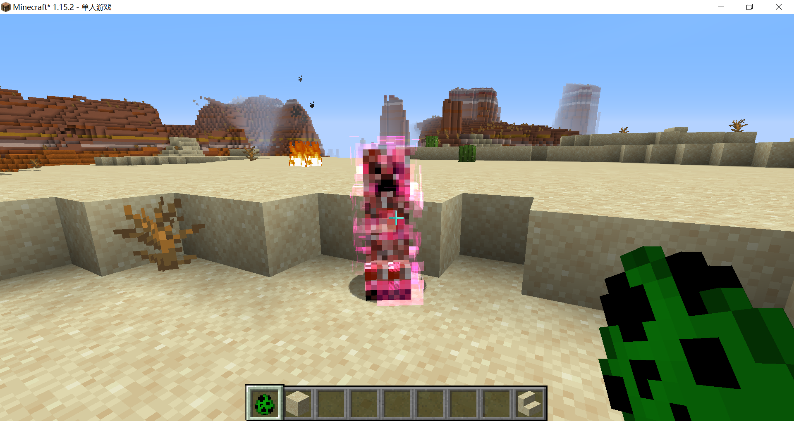

# 苦力怕——生物群系

我们要让苦力怕在不同生物群系拥有不同的颜色，在寒冷的生物群系出生的苦力怕是蓝色的，在炎热的生物群系出生的苦力怕是红色的，在其他群系出生的苦力怕是绿色的。包括高压苦力怕的电火花材质。

在optifine文件夹下新建名为mob的文件夹，在mob文件夹下新建creeper文件夹以便于管理。

绘制好材质，简单调色就可以了，将其放置在creeper文件夹下，并按照如下命名：



这里只放了红色和蓝色苦力怕，绿色苦力怕是默认材质，我将默认的电光材质也改成了绿色。

新建文件名为creeper.properties，与ctm和cit不同，这个文件名是强制的，必须用实体id，不可用别的命名。

**creeper.properties**

```properties
# 第一套随机材质
# 材质序号为2
textures.1=2
# 出现在沙漠（偷懒就只写了沙漠）
biomes.1=minecraft:desert

# 第二套随机材质
# 材质序号为3
textures.2=3
# 出现在各种寒冷的群系
biomes.2=frozen_ocean frozen_river snowy_mountains snowy_tundra snowy_beach snowy_taiga snowy_taiga_hills deep_frozen_ocean ice_spikes snowy_taiga_mountains
```

现在我们找到一块寒冷的群系，生成一只苦力怕：



```
/summon minecraft:lightning_bolt
```

雪原中最靓的崽：



雨林中最靓的崽：



沙漠中最靓的崽：



<br/><br/><Vssue/>