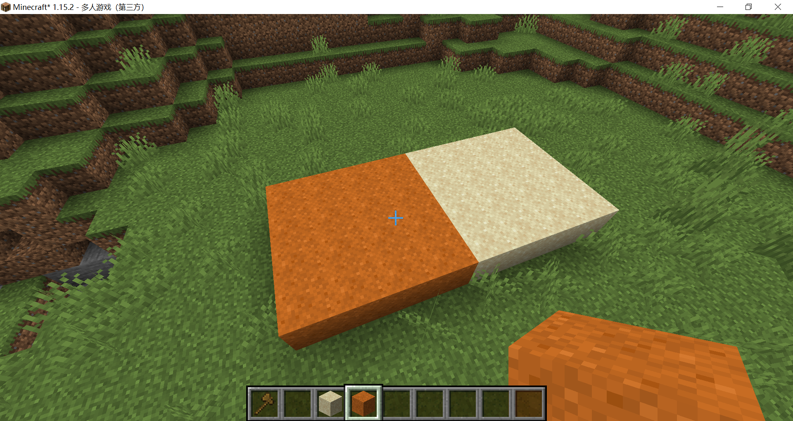
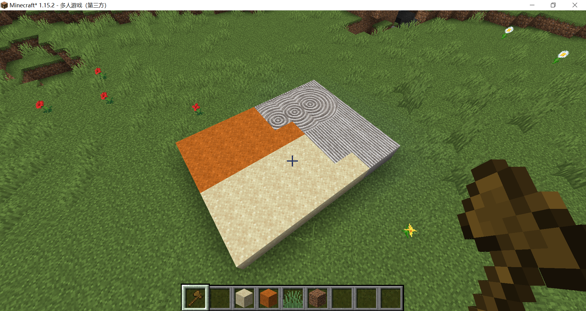

# 枯山水——生物群系

我们不希望所有的沙子都是这样的枯山水材质，OptiFine允许限定连接材质出现的生物群系，本节我们要将枯山水材质限定在虚空（the_void）生物群系，因为虚空生物群系不会自然生成在普通世界中，我们可以用WorldEdit设置生物群系进行控制。

在两种枯山水的属性文件中分别加入这一行：

```properties
biomes=minecraft:the_void
```

保存，重载资源包，然后进入服务器（因为1.15.2的forge和optifine尚不兼容，我只能开个本地服务器，用bukkit版本的worldedit修改生物群系）



我们看到沙子和红沙的材质都恢复了，现在我们修改一下生物群系：


我们看到被修改为the_void生物群系的区域材质变成了ctm材质。虽然生物群系生成的范围似乎有些问题，不过我们本节的目的已经达到了。



::: tip

生物群系列表可以查看[Minecraft wiki](https://minecraft-zh.gamepedia.com/index.php?title=生物群系&variant=zh#.E7.94.9F.E7.89.A9.E7.BE.A4.E7.B3.BBID)

对于1.13以前的版本，生物群系的id大不相同，可以查阅[扁平化前的Java版数据值](https://minecraft-zh.gamepedia.com/Java版数据值/扁平化前#.E7.94.9F.E7.89.A9.E7.BE.A4.E7.B3.BBID)

:::

<br/><br/><Vssue/>