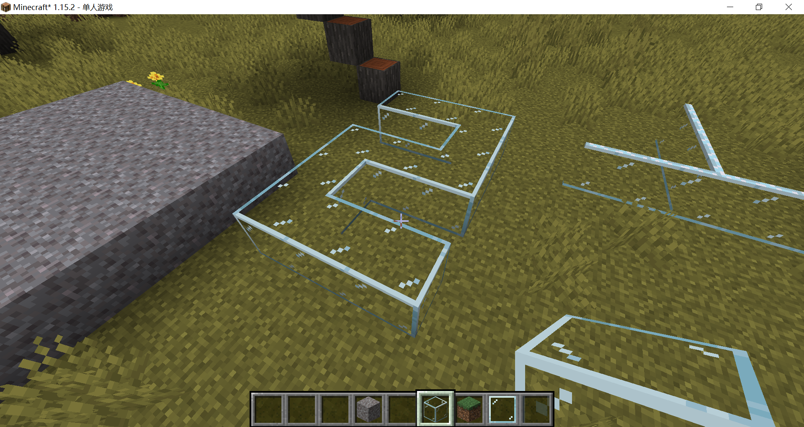
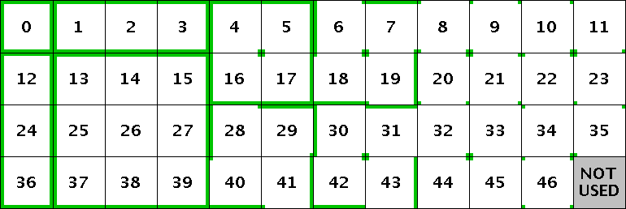
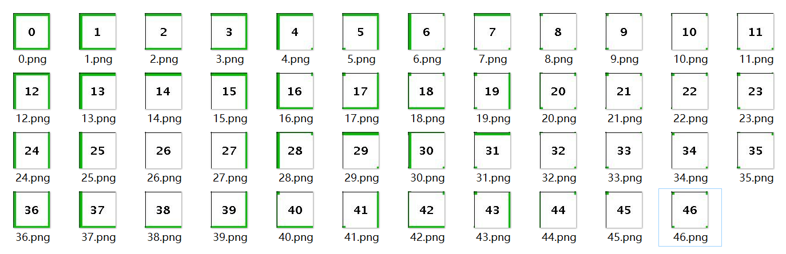
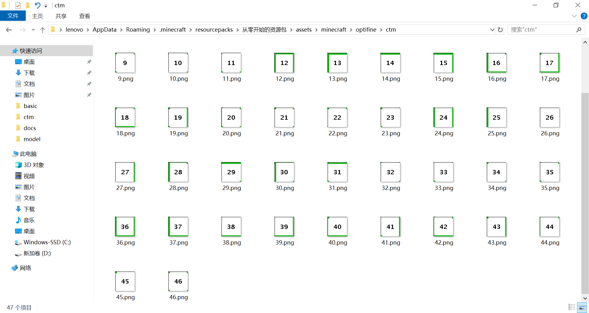
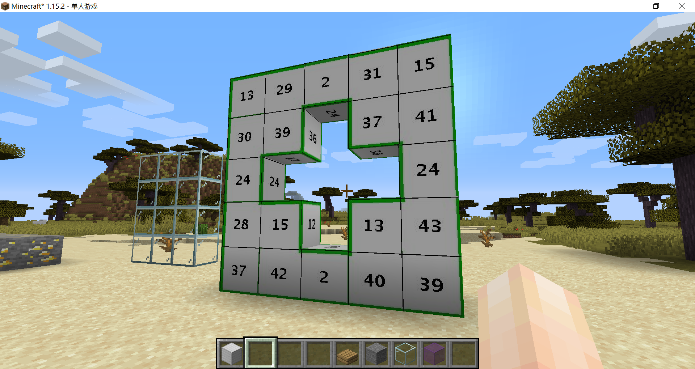
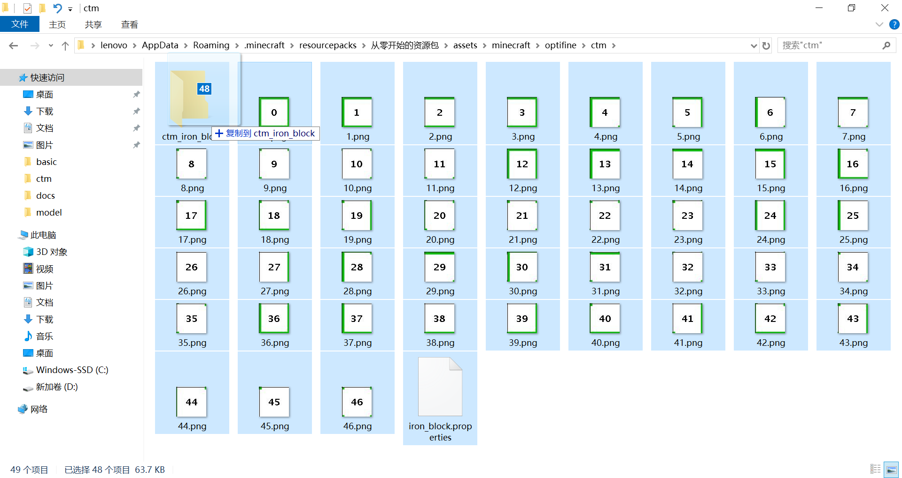

# CTM方法

CTM方法作为最基本的连接材质方法，常见于玻璃，通常情况下，OptiFine会内置玻璃的CTM材质（但常常会不显示）。

::: warning 注意

CTM方法是最原始的连接材质方法，以至于它和连接材质同名，但二者是包含关系。

:::

CTM方法看上去是这样的：



在上面这张图片中，玻璃之间的接缝被完全抹除，只剩下作为整体的边框，这就是CTM的设计初衷，虽然现在许多创作者用CTM做出了完全不一样的东西，其实都是对这种方法的创新。

## CTM的实现

CTM方法本质上就是穷举，它根据材质的位置，将所有可能的图样都穷举出来，总共有47种之多。

这导致CTM的绘制非常繁琐，为了简化操作，OptiFine还提供了一种简化CTM方法，只需要5张材质，将会在之后介绍。



方便起见，我们不妨就用OptiFine作者提供的模板制作一个CTM材质，并用于铁块。

先把这张图分割开：



现在让我们回到资源包文件夹，在assets文件夹下新建一个叫做optifine的文件夹，然后在optifine文件夹内新建名为ctm的文件夹，将图片拖进去。



::: warning 注意

在1.13以前的版本，ctm文件夹是放在名为mcpatcher的文件夹内的，路径为assets/minecraft/mcpatcher/ctm，1.13版本后，所有原先放在mcpatcher文件夹下的内容都转移至optifine文件夹下了。

:::

在此处新建一个文本文件，命名为iron_block.properties（这样命名是为了方便识别，你可以在符合规定的前提下任意取一个名字，当然后缀名必须是properties），打开文件，输入以下代码：

```properties
method=ctm
tiles=0-46
matchBlocks=minecraft:iron_block
```


保存，进入游戏加载资源包，放出铁块：



非常完美！通过这个例子，我们可以轻易看出CTM的每张材质会出现在什么位置。

简单解释一下刚才写的[properties文件](https://zh.wikipedia.org/wiki/.properties)，到目前为止还是第一次出现这种格式的文件，要制作OptiFine资源包，我们必须得和它打交道了。

```properties
# 这是一行注释
# properties文件就是由下面这样的 key=value 格式组成的，每一行都是一个键值对
# method表示我们使用的连接材质方法，这里我们使用ctm方法，所以填ctm
method=ctm
# tiles表示我们要使用哪些图片，0-46是一种简写，它表示从0.png到46.png这47张材质
tiles=0-46
# matchBlocks表示我们要让什么方块使用这些材质，填写的是铁块的方块id
matchBlocks=minecraft:iron_block
```

举一反三，相信你已经可以根据[文档](https://www.mcbbs.net/forum.php?mod=viewthread&tid=896135&page=1#pid15602841)填写更多的属性（properties）了。

::: details 良好的习惯

ctm材质和相应的属性文件可以放在ctm文件夹的任意一级子文件夹下，所以分门别类进行整理是一个良好的习惯。



:::

<br/><br/><Vssue/>