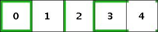
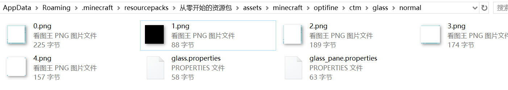
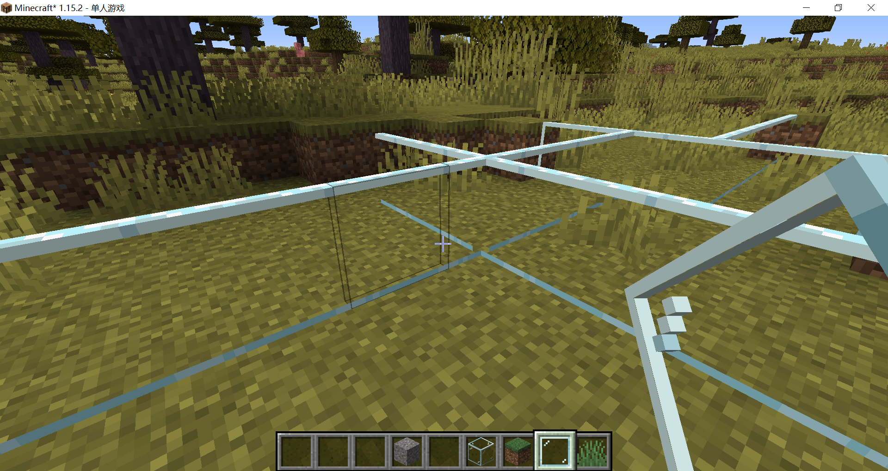
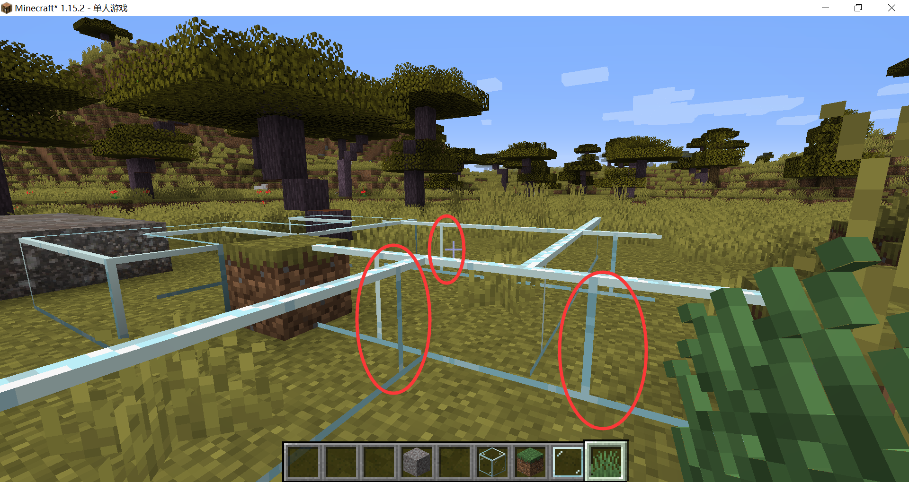

# 简化CTM方法

前面我们提到，对于一些简单的情况，制47张材质过于繁琐了，于是OptiFine提供了一种简化方法，只需要5张材质：



是不是很神奇？这五张材质是如何变成游戏中看到的样子的？

```java
/**
 * 借用一下CTM模组的设计，CTM模组是Chisel团队开发的独立于OptiFine的，可以实现连接材质的模组：
 * ┌─────────────────┐ ┌─────────────────┐ ┌─────────────────┐
 * │ 0.png           │ │ 1.png           │ │ 2.png           │
 * │ ╔══════╤══════╗ │ │  ──────┼──────  │ │ ║──────┼──────║ │
 * │ ║      │      ║ │ │ │      │      │ │ │ ║      │      ║ │
 * │ ║ 0    │ 1    ║ │ │ │ 4    │ 5    │ │ │ ║ 8    │ 9    ║ │
 * │ ╟──────┼──────╢ │ │ │──────┼──────│ │ │ ║──────┼──────║ │
 * │ ║      │      ║ │ │ │      │      │ │ │ ║      │      ║ │
 * │ ║ 2    │ 3    ║ │ │ │ 6    │ 7    │ │ │ ║ 10   │11    ║ │
 * │ ╚══════╧══════╝ │ │  ──────┼──────  │ │ ║──────┼──────║ │
 * └─────────────────┘ └─────────────────┘ └─────────────────┘ 
 * ┌─────────────────┐ ┌─────────────────┐
 * │ 3.png           │ │ 4.png           │
 * │ ═══════╤═══════ │ │ ╝ ─────┼───── ╚ │
 * │ │      │      │ │ │ │      │      │ │
 * │ │ 12   │ 13   │ │ │ │ 16   │ 17   │ │
 * │ │──────┼──────│ │ │ │──────┼──────│ │
 * │ │      │      │ │ │ │      │      │ │
 * │ │ 14   │ 15   │ │ │ │ 18   │ 19   │ │
 * │ ═══════╧═══════ │ │ ╗ ─────┼───── ╔ │
 * └─────────────────┘ └─────────────────┘ 
 * 
 * 如图所示，在程序内部，这五张图片被横一刀竖一刀拆分成了20张小图片。
 * 通过拼接这20张小图片，可以得到CTM方法的47张图片（然而开了脑洞的ctm是无法用简化ctm方法实现的）。
 * 
 * 连接0,13,2,15，我们可以获得一张向右连接的材质（CTM方法的1号材质）：
 * ╔══════╤═══════
 * ║      │      │
 * ║ 0    │ 13   │
 * ╟──────┼──────┼
 * ║      │      │
 * ║ 2    │ 15   │
 * ╚══════╧═══════
 * 
 * 连接8,17,2,15, 我们可以获得一张L形拐角材质，连接到右侧和上方（CTM方法的16号材质）
 * 
 * ║ ─────┼───── ╚
 * ║      │      │
 * ║ 8    │ 17   │
 * ╟──────┼──────┼
 * ║      │      │
 * ║ 2    │ 15   │
 * ╚══════╧═══════
 * 
 */
```

::: warning

玻璃板使用简化CTM方法会出bug！

详见这个issue：[https://github.com/sp614x/optifine/issues/463](https://github.com/sp614x/optifine/issues/463)

:::

## 失败的尝试

虽然知道有bug，但是简化CTM还是很诱人的，我还是尝试用简化CTM方法制作了玻璃材质（1号材质黑了是因为它现在彻底透明了）：



**glass.properties**

```properties
method=ctm_compact
tiles=0-4
matchBlocks=minecraft:glass
```

我们看到简化CTM方法用于玻璃还是非常的稳健：


我们再试着用于玻璃板：


它的顶部也被连接了，我们加上faces=sides将连接材质限制在侧面：

```properties
method=ctm_compact
tiles=0-4
matchBlocks=minecraft:glass_pane
faces=sides
```



至此我以为简化CTM玻璃板不过如此，直到我转到了另一面：



这种问题的确不是我有办法解决的，只能放弃了。

<br/><br/><Vssue/>