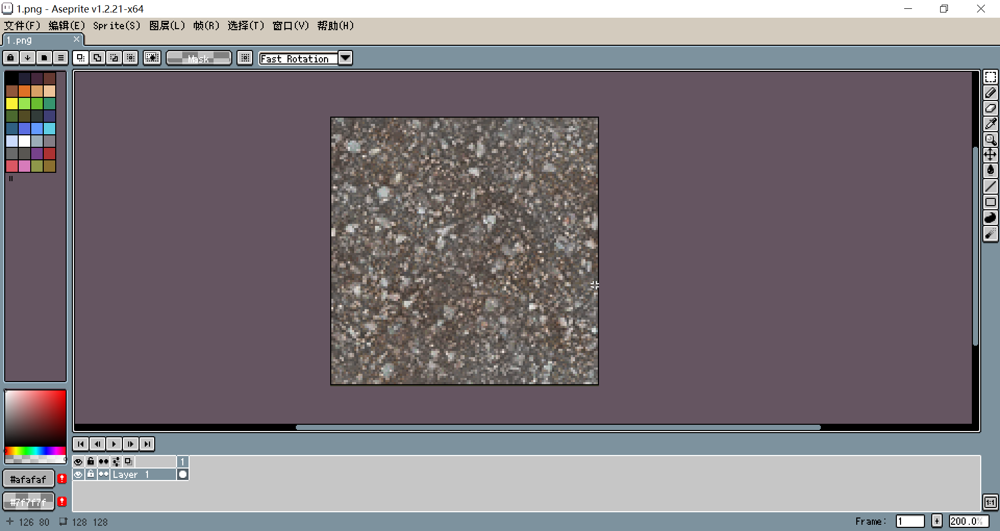
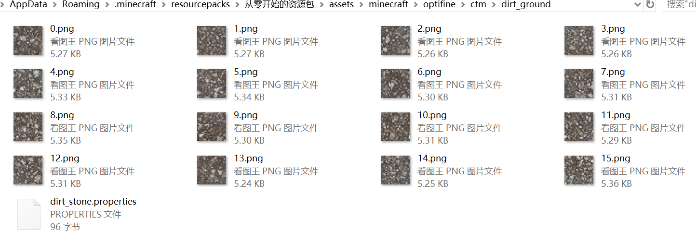
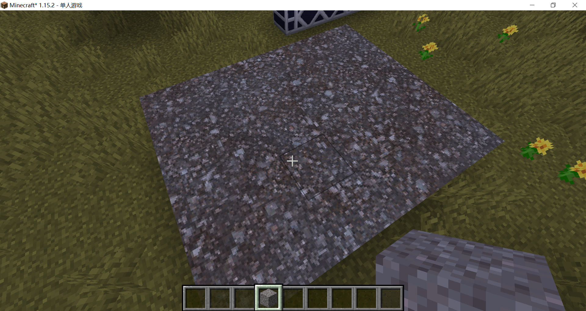

# 砂砾——重复图案

为了防止同一种方块的材质千篇一律，又不显得完全随机，杂乱无章，重复图案材质是一个很好的选择。

我的朋友制作了这张128×128的石子路面，我们要用它替换砂砾：



我们将其分割为32×32的16份：



**dirt_stone.properties**

```properties
method=repeat
# 选用matchTiles的另一个好处就是它可以很好地兼容雕刻一类的模组
# 此外，matchTiles相比matchBlocks具有优先权
# 所有matchTiles的属性文件会在macthBlocks的属性文件前检测
matchTiles=minecraft:gravel
# tiles的数量要等于height×width，顺序为从左到右，从上到下
tiles=0-15
height=4
width=4
```

于是我们成功将砂砾换成了大块的图案（离远了看有点像芝麻糖？）：



<br/><br/><Vssue/>