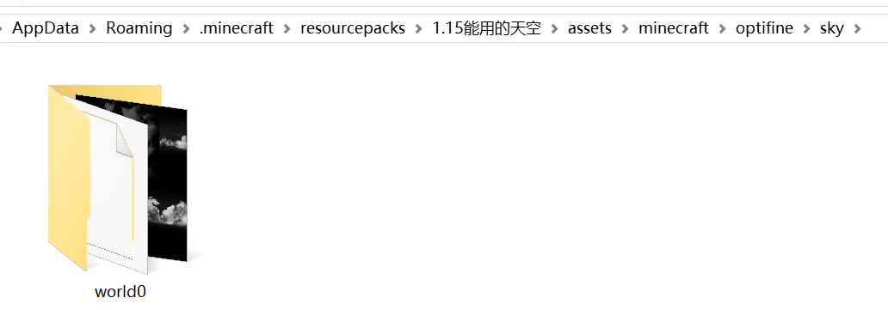
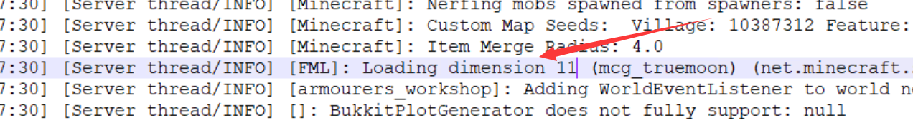
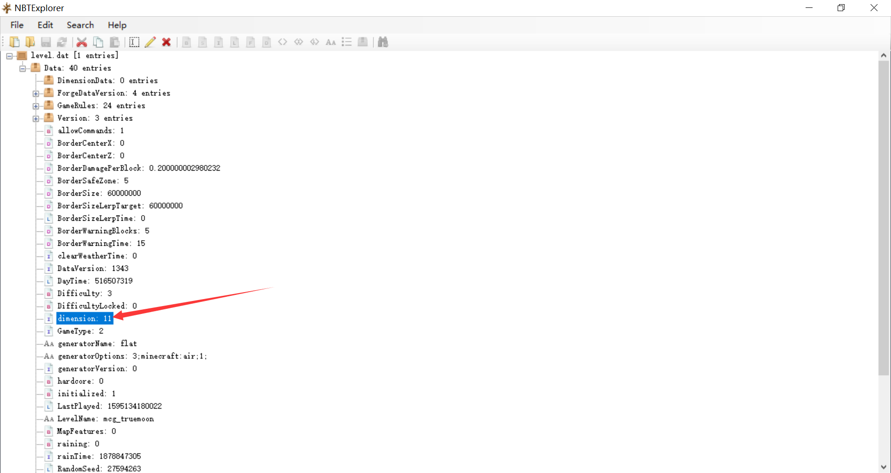

# 多世界天空盒（服务器用）

> 这个教程是给有很多个世界的服务器使用的。

::: warning

此方法比较玄学，未必能适用于你的服务器。

- 如果客户端安装天空材质后，在服务器的所有主世界都能看见天空材质，则此方法不可用。这可能是因为有些服务端加载多世界的方式使得实际运行时所有主世界的维度id都是0。
- 如果客户端安装天空材质后，仅在初始世界可看见天空盒材质，此方法应该可行。

:::

作为腐竹，你有没有过用了某款天空材质包，但是只有初始世界才能显示天空的体验？在本教程中，你将学会如何突破限制，让每个世界用上独特的天空材质。

我们随便下载一个有天空材质的材质包，解压，打开assets/minecraft/optifine/sky文件夹，里面有一个名为world0文件夹，world0文件夹内就是天空的材质了。

::: tip

1.12.2以及之前的版本中，world0文件夹所在的路径为assets/minecraft/mcpatcher/sky。

:::

我们知道主世界的维度id为0，末地的维度id为1，下界的维度id为-1，world0文件夹的0也就表示主世界的维度，多世界插件创造的世界以及模组创造的世界都有其维度，如果一个世界的维度id为7，那么将world0文件夹改名为world7，就可以将里面的天空材质用于这个世界。

::: warning

天空材质无法用于末地和下界。也无法用于维度id大于等于10的世界。

:::

接下来的问题就是，如何知道某个世界的维度。不是很难，找到日志（log）文件，搜索关键词dimension，应该很快就能得到需要的东西：

我们清楚地看到名为mcg_truemoon的世界的维度id为11。

还有一个办法就是用nbtexplorer打开世界的level.dat文件，也很容易就能找到维度id：

