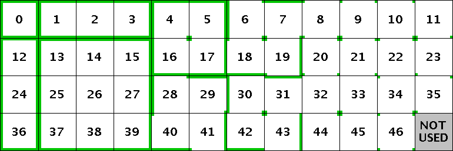
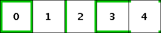
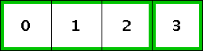
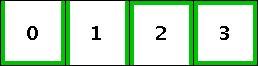
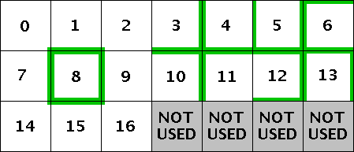

<center><h1>连接纹理</h1><p>Connected Textures</p></center>

## CTM丨Connected Textures mod

连接纹理，原先是 MCPatcher 的功能，它提供了一系列连接方块纹理的方法。

如果你想要某个方块（block）或者图块（tile）覆盖上连接纹理或者随机纹理，请在纹理包的optifine/ctm文件夹下新建一个后缀为 .properties 的文件。属性（properties）文件可以放在 optifine/ctm 的任意一层子文件夹下。

译注：这里所谓的 "图块（tile）" 指的就是 assets 里面的一张张图片，虽然[译名标准化](https://minecraft-zh.gamepedia.com/Minecraft_Wiki:%E8%AF%91%E5%90%8D%E6%A0%87%E5%87%86%E5%8C%96)里 tile 是不翻译的，但是 tile 在某些情境下可以翻译成"方块"，为了避免混淆，还是按照感觉给出个译名。

针对不同需求和限制，可以使用不同的连接方块纹理的方法。下面将介绍如何使用每种方法。

::: warning
所有属性名称都区分大小写。除非另有说明，否则所有的路径都相对于assets/minecraft。
:::


## 公共属性丨General properties

**（可选）列出这个方法所应用于的方块/图块**

同一个方块/图块可以有多个属性文件，它们会按照文件名的字母顺序依次加载。所有用于图块的属性文件会在用于方块的属性文件之前被检测，第一个匹配的属性文件会被加载。

```properties
matchTiles=<需要匹配的图块列表>
```

要表示原版mc中的图块，只需要使用它在 textures/block 中的文件名：

```properties
matchTiles=dirt
```

要表示模组添加的图块，你需要知道模组的名字：

```properties
matchTiles=botania:blazeblock
```

译注：我使用1.12版本似乎测试出了不一样的结论，如果你用这种格式出现错误，请尝试 modid:blocks/......

一个CTM规则输出的图块还可以被另一个规则匹配。
图块名称就是指向图块的完整路径。

```properties
matchTiles=optifine/ctm/mygrass/1.png
```

方块格式 （<>内为可选部分）：

> <命名空间:>名称\<:属性1=值1,值2...:属性2=值1,值2...>

例如:

> 简称:      oak_stairs
>
> 全名:      minecraft:oak_stairs
>
> 名称+属性:   minecraft:oak_stairs:facing=east,west:half=bottom

```properties
matchBlocks=<方块列表 + 可选属性>
```

如果可以从文件名判断这两个属性，则可以省略它们：

> 如果文件名为 optifine/ctm/xxx/\<name>.properties，则默认
> matchTiles=\<name>
>
> 如果文件名为 optifine/ctm/xxx/block_\<name>.properties，则默认
> matchBlocks=\<name>
>
> 除非你明确指定了属性的值。


**（可选）metadata**

限制匹配的方块的metadata，可以是 0 到 31 的任意值。仅限 1.13 之前的版本。

译注：方块的metadata最高为16，不清楚这里可以到31的原因。

```properties
metadata=<metadata 列表>
```


**（可选）权重**

如果多个属性文件匹配相同的方块，会使用拥有最大权重的属性文件。如果权重相同，会接着比较属性文件名。

默认的权重为0。

**译注：这个属性可能已经没用了，我查看了1.15.2版本的 OptiFine 源码，属性文件解析器根本不会解析weight属性。（[已被sp614x承认](https://github.com/sp614x/optifine/issues/4294)）**

```properties
weight=<整数>
```


**（必需）替换纹理的方法**

可选的方法：

> ctm: 标准ctm方法（例如原始的ctm玻璃），使用47个图块
>
> ctm_compact: 简化ctm方法，使用5个图块
>
> horizontal: 只连接到侧面的方块（例如书架）
>
> vertical: 只连接到上方和下方的方块
>
> horizontal+vertical: 优先水平连接，无法水平连接时才垂直连接
>
> vertical+horizontal: 优先垂直连接，无法垂直连接时才水平连接
>
> top: 仅连接到上方的方块（例如砂岩）
>
> random: 随机选择图块
>
> repeat: 大面积重复固定的图案
>
> fixed: 使用单个固定图块。相当于只设置一个图块的随机
>
> overlay: 用于方块间过渡的覆盖层，使用17个图块
>
> overlay_ctm: 方法 "ctm" 的 overlay 变体
>
> overlay_random: 方法 "random" 的 overlay 变体
>
> overlay_repeat: 方法 "repeat" 的 overlay 变体
>
> overlay_fixed: 方法 "fixed" 的 overlay 变体

如果overlay方法的处理顺序在其他方法之前，则可以将它们与其他方法组合在一起。（按照字母顺序）

方法 "ctm_compact" 和任何 overlay 方法都不兼容。

```properties
method=<方法名>
```


**（必需）图块列表**

就像方块和物品纹理。每一个图块必须是一张独立的图片，
可以用以下几种格式来表示图块：

> 0               -> 0.png
>
> 8-11            -> 8.png, 9.png, 10.png, 11.png
>
> name          -> 文件名.png
>
> name.png      -> 文件名.png
>
> \<skip>         -> 跳过图块，继续使用下一个CTM属性
>
> \<default>      -> 对方块/图块使用默认纹理
>
> full/path/name.png -> 完整路径/文件名.png

除了最后一种格式，png文件必须和属性文件在同一个根目录下。

这些格式可以混合搭配，例如：

```properties
tiles=0-4 5 some/other/name.png
```

对于要跳过的空图块，overlay 方法可以使用特殊的名称 "\<skip>"，但不能使用图块名称 "\<default>"。

```properties
tiles=<图块列表>
```


**（可选）连接类型**

即连接到毗邻方块的条件，告诉游戏在什么情况下应该连接两个方块的纹理。

> block: 当这个方块的id = 相邻方块的id时连接
>
> tile: 当这个方块的图块 = 相邻方块的图块时连接
>
> material: 当这个方块的材料（stone, dirt, etc.）= 相邻方块的材料时连接
>
> state: 当方块状态（block + properties）= 相邻方块的状态时连接

用于方块的属性文件默认为 block；用于图块的属性文件默认为 tile。

```properties
connect=<block | tile | material | state>
```


**（可选）面**

将方法的作用范围限制在方块确定的面。

> bottom: 底面 (负y)
>
> top: 顶面 (正y)
>
> north: 北面 (负z)
>
> south: 南面 (正z)
>
> east: 东面 (正x)
>
> west: 西面 (负x)
>
> sides: "东面 西面 南面 北面" 的总称
>
> all: 所有面

不规则方块会忽视这个属性。

```properties
faces=<以下的组合: north south east west top bottom sides all>
```


**（可选）生物群系和高度范围**

限定生物群系或高度范围。

[这里](https://minecraft.gamepedia.com/Biome#Biome_IDs)列出了原版生物群系ID。也可以使用模组添加的生物群系。

旧属性 "minHeight" 和 "maxHeight" 也可以被识别。

```properties
biomes=<生物群系列表>
heights=<高度范围>
```


**（可选）名字**

只适用于具有对应的可命名的方块实体的方块。

例如：

> beacon(信标) brewing_stand(酿造台) enchanting_table(附魔台) furnace(熔炉) dispenser(发射器) dropper(投掷器) hopper(漏斗)

关于匹配名称的语法，参阅 "custom_guis.properties"。

```properties
name=<名字>
```

::: warning
下文所有内容都针对特定连接纹理方法。

每一个 .properties 文件都应该仅包含其中一个小节列出的属性。
:::

## 标准CTM方法丨Standard 8-way connected textures

> method=ctm

**（必需）47个图块**

```properties
tiles=<47 tiles>
```


**（可选）连接相邻方块时，是否显示内边缘接缝**

```properties
innerSeams=false
```

**模板：**



译注：如果你疑惑为什么需要这么多张图片，不妨亲自尝试一下

## 简化CTM方法丨Compact 8-way connected textures

> method=ctm_compact

译注：此方法不适用于玻璃板，详见 [https://github.com/sp614x/optifine/issues/463](https://github.com/sp614x/optifine/issues/463)


**（必需）5个图块**

```properties
tiles=<5 tiles>
```


**（可选）连接相邻方块时，是否显示内边缘接缝**

```properties
innerSeams=false
```

**模板：**




## 有特例的简化CTM方法丨Compact 8-way connected textures with special cases

> method=ctm_compact

**（必需）简化CTM方法使用的5个图块**

```properties
tiles=<5 tiles> <额外的图块>
```


**（可选）让CTM的一些情况使用指定的图块**

```properties
ctm.46=5
ctm.17=6
```


## 水平连接纹理丨Horizontal-only connected textures

> method=horizontal


**（必需）4个图块**

```properties
tiles=<4 tiles>
```

**模板：**




## 垂直连接纹理丨Vertical-only connected textures

> method=vertical


**（必需）4个图块**

```properties
tiles=<4 tiles>
```

**模板：**




## 顶部连接纹理丨Top connected textures

> method=top


**（必需）只需要1个图块**

```properties
tiles=<单个图块>
```


## 随机纹理丨Random textures

> method=random


**（必需）任意数量的图块**

```properties
tiles=<图块列表>
```


**（可选）权重**

例如，如果

```properties
tiles=6-11
weights=10 1 10 2 7 3
```

那么图块6和8的权重为10，图块7权重为1，以此类推。

权重之和不必为100或任何其他特定值。

在上面的例子中，图块6和图块8的使用频率分别为大约30.3%(10/(10+1+10+2+7+3))，依此类推。

```properties
weights=<对应的权重>
```


**（可选）随机循环**

重复随机函数的次数，用于增加随机性。
可以使不同的纹理使用不同的随机样式。
较高的值可能会降低区块加载速度。
默认值为0。

```properties
randomLoops=<0-9>
```


**（可选）方块的各个面的对称性**

只适用于标准的六面体方块。

> none: 所有6个面都是独立纹理。这是默认值。
>
> opposite: 双向对称；相反的面有相同的纹理，但其他面可能有不同的纹理。
>
> all: 六个面拥有相同的纹理。

```properties
symmetry=<none | opposite | all>
```


**（可选）相邻方块之间的纹理连接**

如果为 true，OptiFine 对所有多方块对象的所有部分使用相同的随机数种子，
例如，高草丛的顶部和底部。

这允许你为多方块对象创建统一的随机纹理。
如果该属性为 false，这两部分会被 "打乱"，也就是说，这两张纹理可能会不匹配。

注: 要使其正常工作，你需要多个 links =true 的属性文件，
以及相同数量的替换纹理和相同数量的权重。

例如，

**double_plant_top.properties：**

```properties
method=random
tiles=grass_top1 grass_top2 grass_top3
weights=1 2 3
linked=true
```

**double_plant_bottom.properties：**

```properties
method=random
tiles=grass_bottom1 grass_bottom2 grass_bottom3
weights=1 2 3
linked=true
```

默认值为false。该连接属性目前仅适用于植物(例如甘蔗)、两格高的植物和门。

```properties
linked=<true | false>
```


## 重复图案纹理丨Repeat pattern textures

> method=repeat


**（必需）重复图案的宽度**

```properties
width=<图案宽度>
```


**（必需）重复图案的高度**

```properties
height=<图案高度>
```


**（必需）图块列表**（也就是按从左到右，从上到下的顺序列出所有图块）

```properties
tiles=<图块列表>
```


**（可选）方块的各个面的对称性**

只适用于标准的六面体方块。默认值为none

> none: 6个面都有纹理，这样图块从所有面看上去都是一样的。
>
> opposite: 双向对称；相反的面具有相同的纹理，这意味着与北面和西面相比，南面和东面的图块将左右镜像。

```properties
symmetry=<none | opposite>
```


## 固定纹理丨Fixed textures

> method=fixed

**（必需）单个图块**

```properties
tiles=<单个图块>
```


## 覆盖纹理丨Overlay textures

> method=overlay

**（可选）连接图块**

只连接使用指定图块的方块

```properties
connectTiles=<图块列表>
```


**（可选）连接方块**

只连接指定的方块

```properties
connectBlocks=<方块列表>
```


**（可选）Tint index**

图块纹理的Tint index，默认为-1（禁用）

```properties
tintIndex=<index>
```


**（可选）Tint block**

用于图块纹理着色的方块。
对于相同的tint index，不同方块使用不同颜色。

```properties
tintBlock=<block>
```


**（可选）Layer**

覆盖纹理应该在哪一层上被渲染。

值：

> cutout_mipped - 有多级纹理的透明纹理
>
> cutout - 没有多级纹理的透明纹理
>
> translucent - 有多级纹理的半透明纹理

默认值为 "cutout_mipped"

```properties
layer=<cutout_mipped|cutout|translucent>
```

**模板：**



