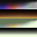
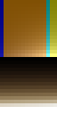

<h1>自定义光照贴图</h1>
Custom Lightmaps

## 概述丨Overview

OptiFine 让你可以自定义游戏中的光照

一个非常好的教程：[https://www.mcbbs.net/thread-1014633-1-1.html](https://www.mcbbs.net/thread-1014633-1-1.html)

**原版光照是如何工作的**

每个方块都有两个范围为 0 到 15 的光照等级（light values），一个是天空亮度（sky brightness），另一个是方块亮度（torch brightness）。

被阳光直射的方块具有值为 15 的天空亮度，与之毗邻的位于阴影下的方块的天空亮度为 14，以此类推。深埋地下，且远离任何能看到天空的方块的方块的天空亮度为 0。方块亮度也类似。一个火把方块的光照等级为 14（荧石为15），每远离一个方块，光照等级下降1。

为了生成你在游戏中实际看见的光照，Minecraft 使用了一张 16x16 的光照贴图。它的两个轴分别对应两个种类的16个光照等级。

如果一个方块具有方块亮度 x 和天空亮度 y，那么坐标 (x,y) 就会作为它的光照贴图坐标。

光照贴图不在游戏的任何文件夹内，但每一帧都会生成。

两个变量影响光照贴图，一天中的时间和火把的闪烁。

通过让整个光照贴图变暗或变亮，Minecraft实现了黄昏/黎明的过渡和火把闪烁（torch flicker），而不是通过调整天空/火把的亮度。

## 自定义光照丨Custom lighting

为了创建自定义光照，你需要为每个世界新建一个光照贴图调色板：

> 下界：assets/minecraft/optifine/lightmap/world-1.png
>
> 主世界：assets/minecraft/optifine/lightmap/world0.png
>
> 末地：assets/minecraft/optifine/lightmap/world1.png

对于overworld(主世界)你还可以创建可选的降雨和雷暴天气调色板：

> 主世界降雨：assets/minecraft/optifine/lightmap/world0_rain.png
>
> 主世界雷暴：assets/minecraft/optifine/lightmap/world0_thunder.png

只有在定义了主世界调色板时，降雨和雷暴天气调色板才生效。

每个调色板都可以是任意宽度，但高度必须是32或64像素。如果高度为64像素，下半部分将用于夜视效果，这将于稍后讨论。

在32行像素中，上面16行代表阳光，下面16行代表火把的光。

两个列，上半部分的16个像素和下半部分的16个像素，被选择来形成最终用于渲染的16x16光照图的轴线。

模板: images/lightmap_template.png

蓝色代表夜晚，橙色代表黄昏/黎明，青色代表白天，黄色代表闪电。在上半部分，左边代表夜晚，右边代表白天，其间有黄昏/黎明的过渡。调色板的最右边代表闪电。

重申，调色板没有固定的宽度，但是更宽意味着过渡中更多的细节空间。

译注：OptiFine提供的示例看不出对应的颜色了，可以参考下面这张图片，来源于[https://bitbucket.org/prupe/mcpatcher/wiki/Lightmaps](https://bitbucket.org/prupe/mcpatcher/wiki/Lightmaps)

火把的工作原理类似，但在这种情况下，x坐标只是一个模拟火把闪烁的随机值。沿x轴的变化将决定火炬闪烁有多明显。要使火把光线完全稳定，没有闪烁，就要让每一行的所有像素具有相同的颜色。

光照贴图在三个世界 (主世界, 下界, 末地) 中的工作方法都是一样的，但是由于在下界和末地没有昼夜，"一天中的时间(time of day)" 值为常量。对于这些世界你可以简单地给出0-15行相同的颜色。

## 夜视效果丨Nightvision effect

在原版游戏中，夜视效果是通过 1.0 / max(R,G,B) 缩放RGB值计算的。例如，(0.2, 0.3, 0.6) 在除以 0.6之后会变亮为 (0.333, 0.5, 1.0)。

你可以用高度为64像素而不是32像素的自定义光照贴图覆盖这个行为。需要提供四种调色板而不是两种: normal sun, normal torch, nightvision sun, nightvision torch。除了使用32-47行和48-63行，生成光照贴图的方式完全相同。

## 参考文献丨References

- [https://bitbucket.org/prupe/mcpatcher/wiki/Lightmaps](https://bitbucket.org/prupe/mcpatcher/wiki/Lightmaps)