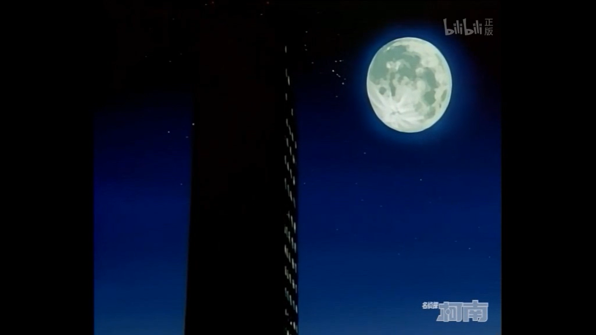
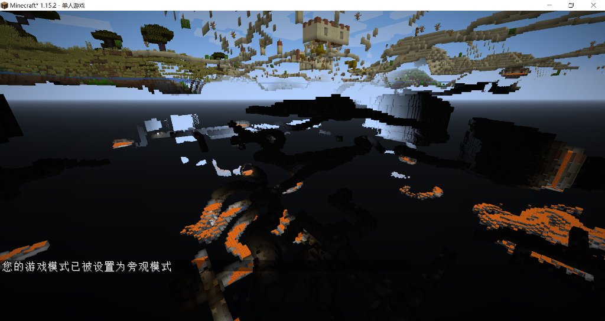
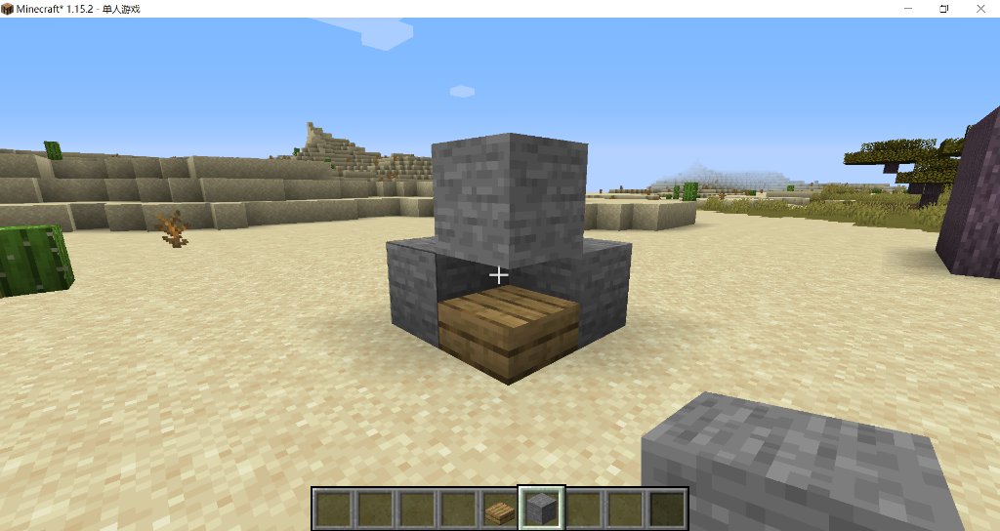
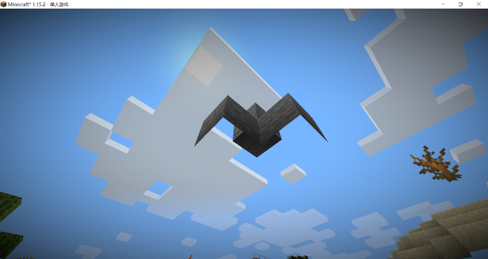

# 面剔除

面剔除（Face culling）是游戏开发中提高渲染效率的重要方式，尤其是像Minecraft这样的游戏中。

想象一个高楼，如果将其简化为一个立方体，它拥有六个面。

但我们真的能看到六个面吗？首先它的底面我们是无论如何也看不到的，其次，我们无法同时看到超过多于三个面，通常情况下我们只能看到两个面——除非飞在高空中，否则我们看不到它的顶面。



如果我们让游戏同时绘制六个面，岂不是太浪费性能！

再看Minecraft，光是地表的方块就非常多，如果算上被掩埋在地底的所有方块，渲染其所有面，计算量将会十分庞大。理所应当，看不到的面就不应该渲染，当我们开启旁观者模式，潜入地下，我们会直接透视到远处的岩浆湖。从我们的视点到远处的岩浆湖之间数不清的方块根本没有被渲染。



这之间的绝大部分面，都被面剔除算法给舍弃了，如果一个方块紧挨着另一个方块时，这两个方块的相邻的面都不应该被渲染。道理很简单，但实际操作时，还会出现很多麻烦的问题。例如，怎样才算是紧挨着？如果挨着的方块是透明的应该怎么办？如果紧挨着的面不够大，盖不全该怎么办？

这些问题从两方面解决了，一个是对方，一个是己方。

从对方考虑，如果对方不是一个完整的不透明方块，那我们认为它无法遮挡住一个面，也就不会发生面剔除。

如果对方是一个完整的不透明的方块，例如一块石头。我们就要从己方考虑，这边是一个什么样的方块？

拿最基础的下半台阶为例：

**slab.json**

```json
{
  "parent": "block/block",
  "textures": {
    "particle": "#side"
  },
  "elements": [
    {
      "from": [ 0, 0, 0 ],
      "to": [ 16, 8, 16 ],
      "faces": {
        "down":  { "uv": [ 0, 0, 16, 16 ], "texture": "#bottom", "cullface": "down" },
        "up":    { "uv": [ 0, 0, 16, 16 ], "texture": "#top" },
        "north": { "uv": [ 0, 8, 16, 16 ], "texture": "#side", "cullface": "north" },
        "south": { "uv": [ 0, 8, 16, 16 ], "texture": "#side", "cullface": "south" },
        "west":  { "uv": [ 0, 8, 16, 16 ], "texture": "#side", "cullface": "west" },
        "east":  { "uv": [ 0, 8, 16, 16 ], "texture": "#side", "cullface": "east" }
      }
    }
  ]
}
```



我们看到这个台阶的四面被放上了完整不透明方块。其顶部虽有方块，但并未被剔除。

但是我们来到一个与之对立的视点。就完全看不到这个台阶了，这个方向的三个面全部被剔除。



由此我们可以完全理解模型文件中用于面的cullface参数：

如果一个面的cullface为south，当这个方块的南方为一个完整不透明方块时，这个面就会被剔除。

而例子中的台阶的顶面没有cullface，当然也就不会被剔除。

::: tip 提示

你说在最后一张图中台阶的顶面也未被渲染？

当一个面背对着玩家时，这个面就已经被宣判死刑了，哪里还需要判断这么多东西。

:::

## 拓展阅读

[Minecraft中文wiki: 不透明度](https://minecraft-zh.gamepedia.com/教程/不透明度)

<br/><br/><Vssue/>