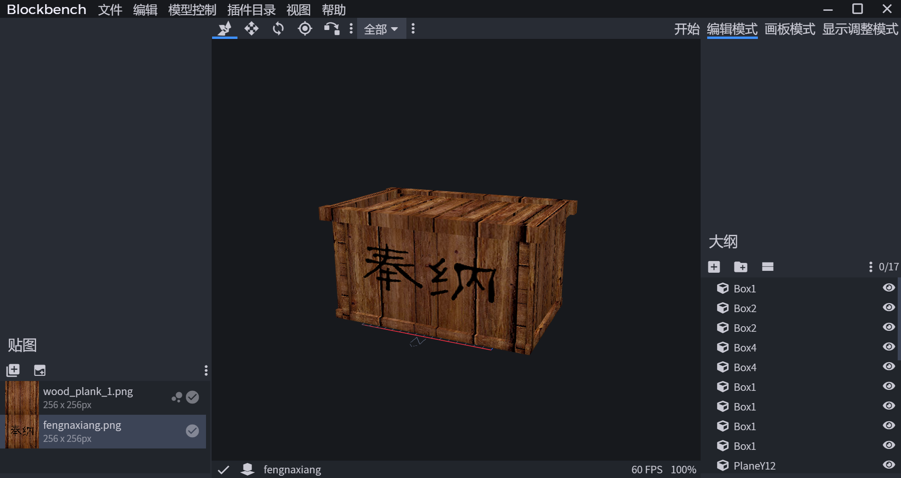
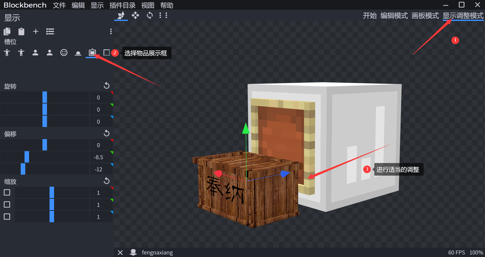
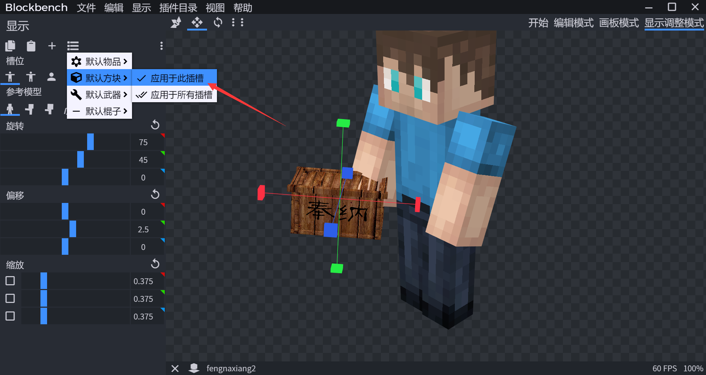
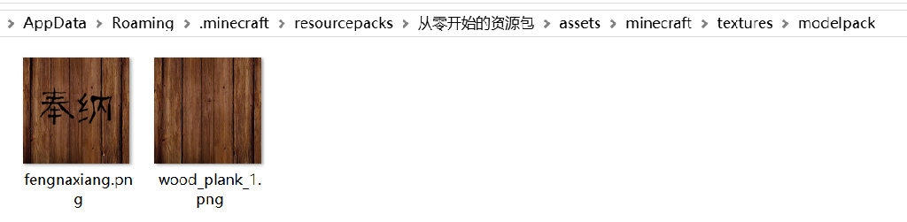
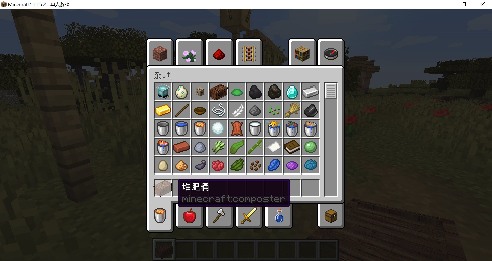
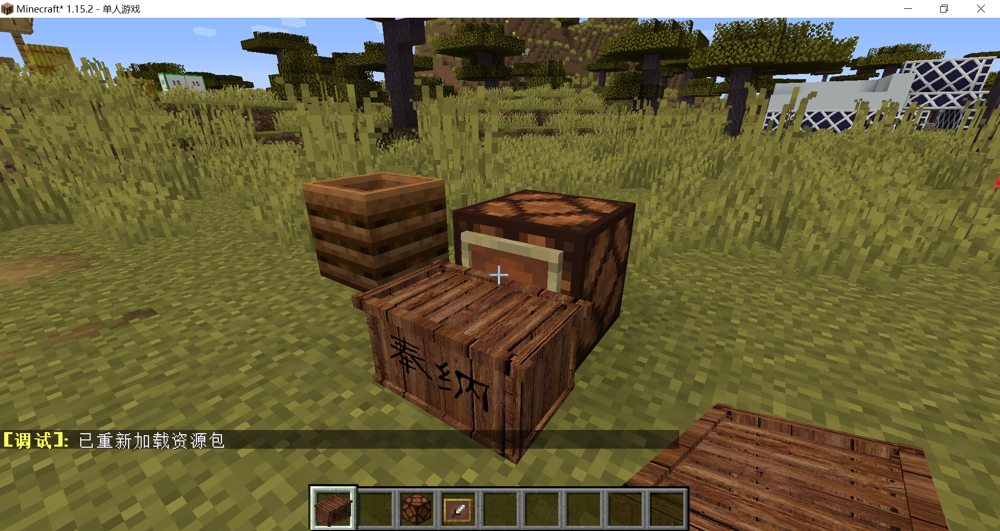
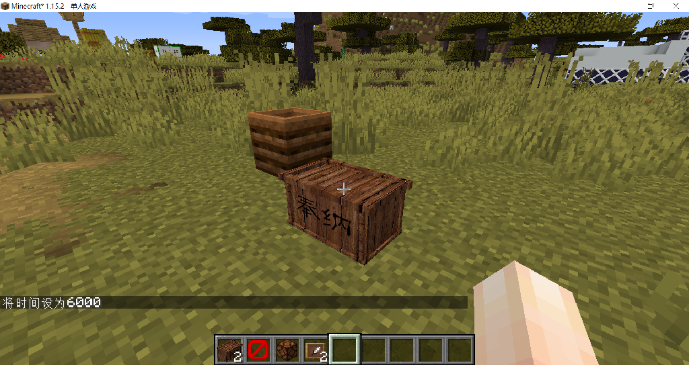

# 物品展示框——附加模型包

在模型章节，我们认识到了原版方块模型存在诸多限制，而原版提供的渲染类型为cutout的方块并不多，那么我们想为资源包添加很多很多的方块模型是不是就没办法了呢？

确实没办法，但是我们可以添加很多很多物品模型，并通过物品展示框展示出来，达到类似方块模型的效果。从Minecraft1.8支持自定义模型起，[IT-Project模型包](https://www.mcbbs.net/thread-524880-1-1.html)就是这么个做法，同时有一个[CustomStuff4](https://www.curseforge.com/minecraft/mc-mods/custom-stuff-4)版本，通过模组增加更多的模型。

现在请观赏IT-Project的宣传视频，感受一下模型包的强大之处：

::: bv 1js41167GP

:::

下面我将演示一下如何利用物品展示框制作附加模型包。

::: warning

物品展示框是实体，放置过多可能会造成游戏严重卡顿。

:::

我把博丽神社的奉纳箱偷了过来（材质是随便找的素材）：



调整模型在物品展示框中的显示：



对于其他模型，点击默认方块——应用于此插槽就好了。



导出为json模型，并改名为composer.json，替换掉原先的堆肥桶物品模型（注意是物品模型而不是方块模型），并把材质放到对应位置。

模型文件中textures的路径是相对于assets/minecraft/textures文件夹的路径，放在哪都行，不过我决定放在modelpack文件夹下：

```json
{
	"credit": "Made with Blockbench",
	"textures": {
		"particle": "modelpack/wood_plank_1",
		"texture": "modelpack/wood_plank_1",
		"texture1": "modelpack/fengnaxiang"
	},
	"elements": [
		...
	],
	"display": {
		...
	}
}
```



进入游戏，加载资源包，看看效果：



直接把它放出来，它还会是堆肥桶，因为方块模型没改，但是如果我们放出物品展示框，把它放到物品展示框里，模型就完全不一样了：



现在又出现两个问题，物品展示框会显示出来，物品展示框又必须依附于一个方块。

后一个问题很好解决：放出屏障就可以了。

物品展示框虽然是个实体，却拥有可以自定义的方块模型和材质，我们可以将其材质换成透明材质。

::: tip

从1.16版本起，物品展示框拥有了[Invisible数据标签](https://minecraft-zh.gamepedia.com/Java版1.16#.E9.9D.9E.E7.94.9F.E7.89.A9.E5.AE.9E.E4.BD.93)，可以直接设置不可见的物品展示框。

:::

一个非常省事的做法是，直接把物品展示框的方块模型改成一对花括号：

**item_frame.json**

```json
{
}
```

模型直接失踪，大成功！


