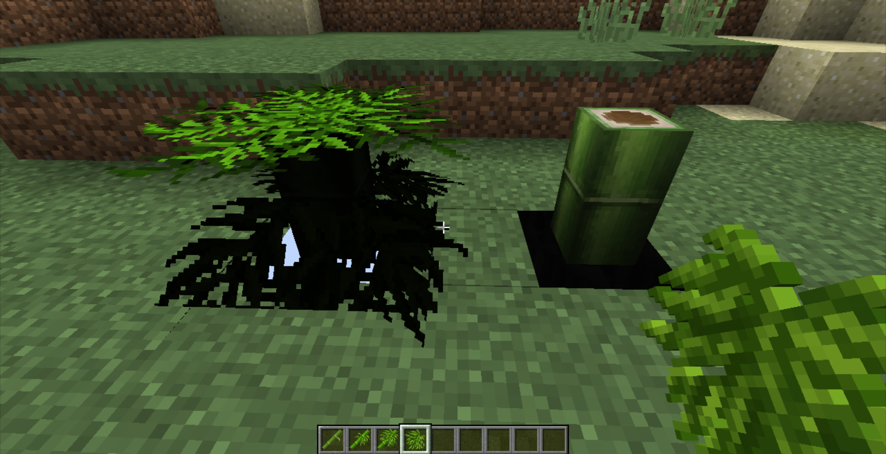

# 不透明方块

很多人在刚接触模型时，做了个方块模型就把原版的某些方块给替换掉了，但往往效果极其糟糕。

例如：

我们发现和我们的模型和其他方块接触的面出现“透视”了，而且一部分材质出奇的黑。

这是因为我们替换的是原版不透明方块，它们占据了绝大部分原版方块。一方面，它们导致了[面剔除](cullface.md)，另一方面，不透明方块内部的亮度计算也和透明方块不同，导致一部分材质变黑。

由于这种事情是写死在代码里的，我们在做模型的时候只能规避这些方块了。

::: tip

学习做mod就可以彻底摆脱这些束缚了

:::

## 拓展阅读

[Minecraft中文wiki: 不透明度](https://minecraft-zh.gamepedia.com/教程/不透明度)
