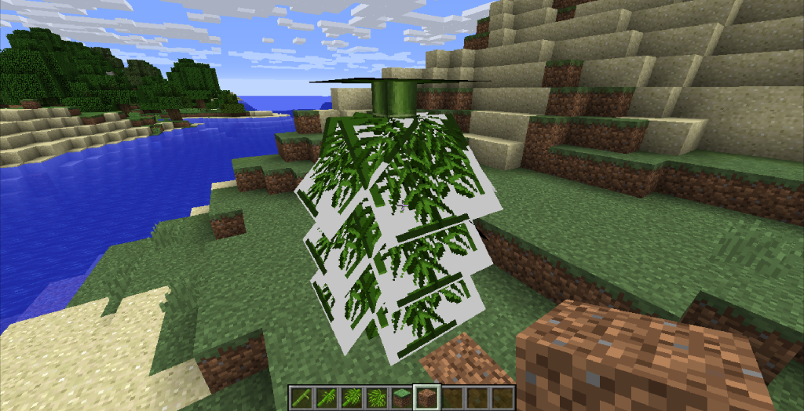

# 渲染类型

除了不透明方块之外，替换原版模型/材质还容易遇到的一个问题就是渲染类型（Render Type）。

我们看到竹叶原本是透明的，但是在这个例子里，透明的部分被渲染为白色了。这是方块的渲染类型导致的。

方块有五种渲染类型：

- SOLID - 绝大部分完整不透明方块是这个渲染类型，不支持alpha通道，即透明度，即便原材质有透明部分，也会被渲染为白色。
- CUTOUT - 绝大部分非完整方块是这个渲染类型，它支持完全透明，但不支持半透明。
- CUTOUT_MIPPED - 带[多级纹理](https://zh.wikipedia.org/wiki/Mipmap)的CUTOUT。
- TRANSLUCENT - 支持半透明材质，冰块就是这个渲染类型。
- TRANSLUCENT_NO_CRUMBLING - 高版本新增的半透明的变种。

下图来源于一个[Blog](https://greyminecraftcoder.blogspot.com/2020/04/block-rendering-1144.html)：

::: tip 提示

渲染类型也是资源包所无能为力的，总而言之，尽量不要用原版方块的模型做一些奇奇怪怪的东西，很容易出现渲染问题。

:::

## 拓展阅读

[Minecraft中文wiki：不透明度](https://minecraft-zh.gamepedia.com/教程/不透明度)

  <Vssue/>