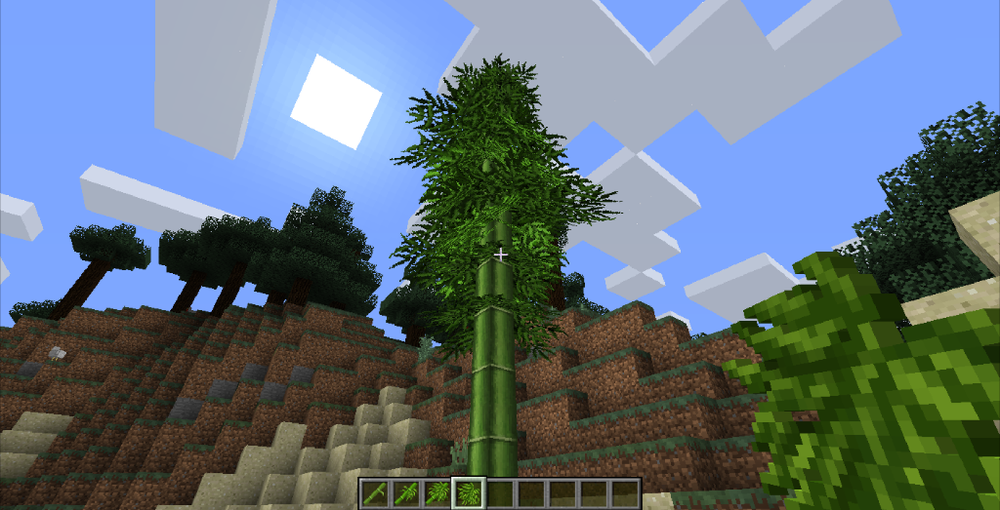
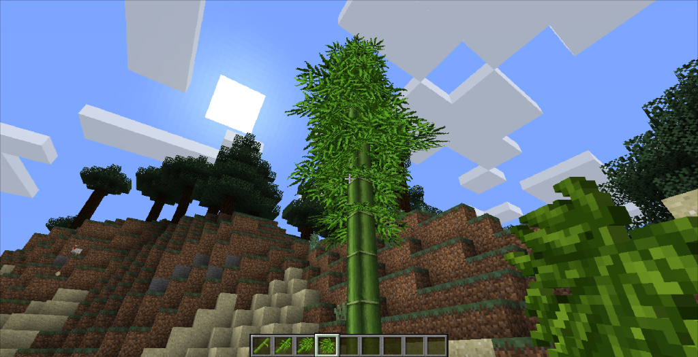

# 阴影

一位朋友在为模组制作竹子的模型的时候遇到了麻烦，促使我注意到Minecraft模型的阴影效果。



竹叶的底面出现了突兀的阴影，这原本也没什么，毕竟没阴影才不正常，但大面积种植后我们发现这样的阴影非常影响观感。

查阅了模型相关的资料之后我们发现方块模型的element有一个叫`"shade"`的选项，默认情况下为`true`，当它为`false`的时候，这个元素就不会渲染阴影了。

```json
{
	"from": [-8, -12, 32],
	"to": [24, 17, 32],
	"shade": false,
	"rotation": {"angle": -45, "axis": "x", "origin": [8, -12, 32]},
	"faces": {
		"north": {"uv": [0, 0, 8, 8], "texture": "#1"},
		"east": {"uv": [0, 0, 8, 8], "texture": "#1"},
		"south": {"uv": [0, 0, 8, 8], "texture": "#1"},
		"west": {"uv": [0, 0, 8, 8], "texture": "#1"},
		"up": {"uv": [0, 0, 8, 8], "texture": "#1"},
		"down": {"uv": [0, 0, 8, 8], "texture": "#1"}
	}
}
```

我们将竹叶的所有元素的`shade`都设置为了`false`，效果如下。



这让我对Minecraft的阴影产生了兴趣，后来我找到了一篇Blog，简单叙述了Minecraft的光照。我也翻译了这篇文章。有兴趣可以点击[这里](https://www.mcbbs.net/thread-1062742-1-1.html)查看。

在这里节选一段，以供参考：

> 除了上述的每个方块的照明，Minecraft还可以为方块的每个面进行一些额外的计算，来增强照明的真实性：
> 
> 这个方法根据面的朝向，用不同的光照强度渲染六个面：
>
> - 顶面（Y+）为最大亮度
>- 底面（Y-）为50%亮度
> - Z轴上的面（Z+、Z-=南、北）为80%亮度
> - Z轴上的面（X+、X-=东、西）为60%亮度
> 
> 

<br/><br/><Vssue/>