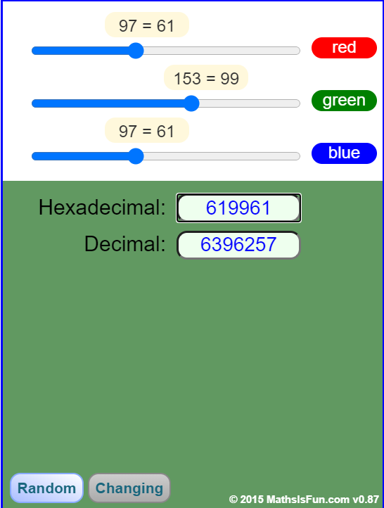
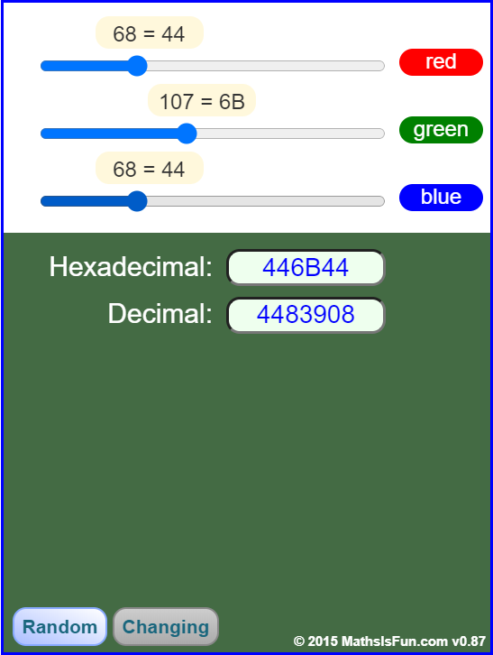
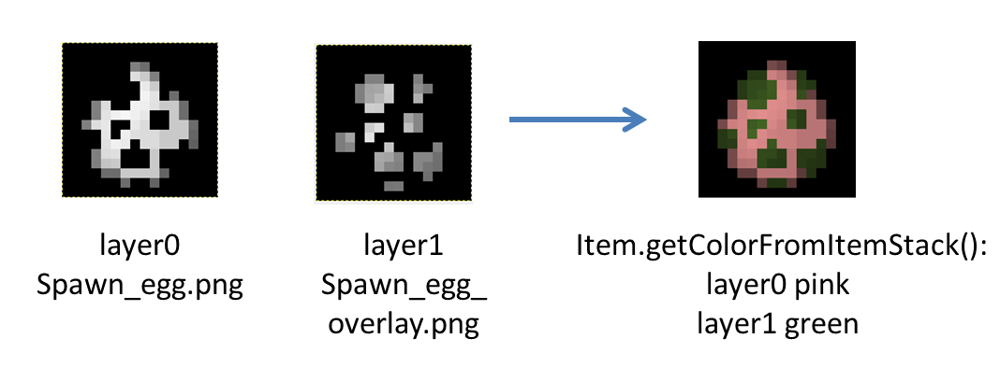

# tintindex

::: warning

本节大部分内容是我阅读源码后给出的理解，如有谬误请批评指正。

本节参考的游戏版本为1.15.2

:::

> 前置知识：
>
> ​	RGB颜色的概念
>
> ​	如果有编程基础，会更容易理解一些

当一个方块或物品设置了tintindex后，它将被试图用硬编码着色。

::: tip

这意味着，如果你不想让已经人工上色的材质被硬编码着色搞得很难看，直接找到对应的模型，删去tintindex或者将tintindex的值改为-1（因为tintindex的默认值为-1）即可。

:::

## 硬编码着色流程

如果一个材质被硬编码着色，那么这个材质原本的颜色会被乘以一个颜色乘数。得到一个新的颜色。

以云杉树叶为例，它的硬编码颜色是6396257，这是一个十进制值，对应着颜色(97,153,97)

::: details 展开查看图片



:::

然后将(97,153,97)除以255，得到颜色乘数(0.38039216, 0.6, 0.38039216)

云杉树叶的材质实际上是一张灰度图，对于它的每一个点，R、G、B三个值都相同。假如有一个像素的颜色为(179,179,179)，它的RGB值与颜色乘数分别相乘，得到(179×0.38039216, 179×0.6, 179×0.38039216)，保留整数为(68,107,68)

结果就是，这个像素被染成了如下颜色：

::: details 展开查看图片



:::

云杉树叶的每一个像素都经过了这样的乘法，最终成为我们在游戏中看到的颜色。

::: tip

我们可以这样理解：云杉树叶的硬编码颜色决定了它的色相和饱和度，而它的灰度图材质决定了每个像素的明度。（但明度的标准定义是RGB三个值的均值，这样说只是便于理解）

:::

上面提到，材质设置了tintindex后，它将被**试图**用硬编码着色。事实上对于大部分方块和物品，并不存在对应的硬编码颜色，如果这些方块或物品的材质被设置了tintindex，获得的颜色乘数其实为(1,1,1)，假设材质上有一点原本的颜色为(a,b,c)，与此颜色乘数相乘后依然是(a,b,c)，什么都不会改变。

::: warning

请勿混淆tintindex和硬编码颜色，这两个是完全不同的概念。硬编码颜色是在Minecraft程序内部定义的，玩家通常无法修改。tintindex只是决定了材质是否要使用硬编码着色，这是玩家可以直接修改的。

:::

## tintindex的不同取值

我们知道tintindex决定了材质是否要使用硬编码着色，但如果tintindex只有这个作用，那为什么它不是一个布尔值（true或false）而是一个整数？

对于方块似乎是这样的，但是对于部分物品，tintindex的具体取值起到了作用。

被绝大部分物品继承的generated有五个渲染层，分别是layer0，layer1，layer2，layer3，layer4，它们的tintindex分别为0,1,2,3,4。

::: tip 提示

原版模型最多使用了layer0和layer1，但另外几个渲染层是实际存在且可以使用的（在OptiFine的自定义物品材质章节中我们将看到渲染层的用法）。

:::

以药水为例：

**potion.json**

```json
{
    "parent": "item/generated",
    "textures": {
        "layer0": "item/potion_overlay",
        "layer1": "item/potion"
    }
}
```

我们看到药水有两个渲染层，截个图给大家看一下分别是什么：

**potion.png**


**potion_overlay.png**


很显然，potion.png是瓶子，不会被染色，而potion_overlay.png是瓶子里的药水，而药水有各种各样的颜色。

在Minecraft内部的实现：

```java
return tintindex > 0 ? -1 : PotionUtils.getColor(...);
```

即判断tintindex是否大于0，如果大于0（对应layer1），返回的颜色乘数为-1（转换后为(1,1,1)，即不染色）；如果不大于0（对应layer0），返回药水的颜色乘数（即染色）。

而刷怪蛋的两个渲染层都会被染色（下图来源于一个[Blog](http://greyminecraftcoder.blogspot.com/2013/08/rendering-items.html)）：



受到类似的规则影响的物品还有**皮革盔甲，焰火之星，地图，药箭**等。

> 深入了解：
>
> ​	光与色（敬请期待）
