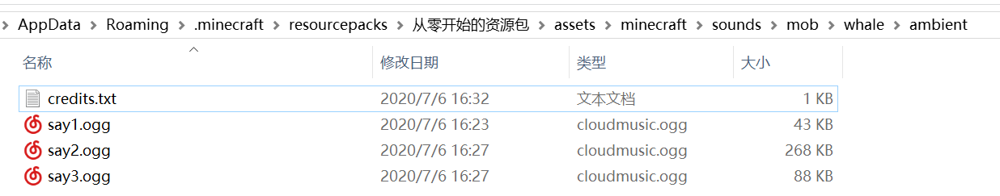
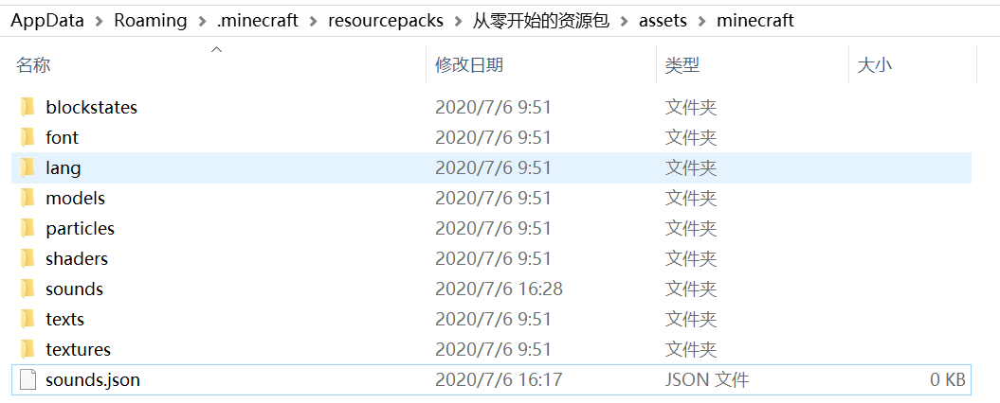
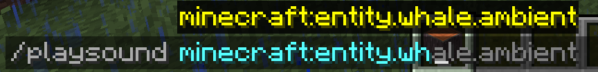

# 添加音效

Minecraft的音效资源是和一个文件密切相关的：sounds.json

## sounds.json

Minecraft使用音效时，并非直接找到音效的资源路径，Minecraft内部使用的是`entity.cow.hurt`之类的格式，sounds.json则储存着这种格式和音效资源文件之间的对应关系。

和音效文件相同，sounds.json也是一个[jar包外部的资源](../more-assets)。如果你不知道怎么找到它，请读一读[这一节](../more-assets)。

::: tip 提示

sounds.json最详细的说明当然得看看[Wiki](https://minecraft-zh.gamepedia.com/Sounds.json)，比这里涉及到的用法全面多了。

:::

撇去json的格式，我们来看看其中的一小段：

```json
"entity.cow.hurt": {
  "sounds": [
    "mob/cow/hurt1",
    "mob/cow/hurt2",
    "mob/cow/hurt3"
  ],
  "subtitle": "subtitles.entity.cow.hurt"
}
```

下面进行解说：

- `"entity.cow.hurt"`是Minecraft内部的**声音事件**，可以通过`/playsound`命令播放。

- `"sounds"`是一个数组，里面是几个**资源路径**，`"mob/cow/hurt1"`实际表示`"assets/minecraft/sounds/mob/cow/hurt1.ogg"`。`sounds`数组内有3个资源路径，表示当声音事件`entity.cow.hurt`触发时，将随机播放这三个音效中的一个。

- `"subtitle"`是一个用于翻译的本地化键，只有游戏开启了"显示字幕"时才会显示。我们可以不加这一行。

## 用sounds.json添加声音事件

没错，sounds.json可以被我们用于添加**声音事件**，并不是真正意义上的添加音效。当我们向资源包的sounds文件夹中添加本不存在的音效文件时，事实上已经向游戏中添加音效了。但是如果不编辑sounds.json，我们没有任何播放这些音效的方式。声音事件就是我们播放音效的窗口。

这里推荐[爱给素材网](http://www.aigei.com/)，这里有许多按照CC协议共享的音效文件。

::: danger 注意版权

在使用非自制的音源时，请一定要尊重作品的版权，未开放使用的音源请勿公开发布。

:::

我下载了3段鲸吼声，转码后放在了如下路径：



在assets/minecraft路径下新建sounds.json



令人高兴的是，sounds.json和大部分资源文件不同，游戏会将所有sounds.json叠加起来，最终游戏中的声音事件包含了每一个sounds.json中的声音事件。

打开sounds.json，向其中添加一个基本的框架：

```json
{
}
```

就这么简单，前面我们说过一个声音事件是如何定义的，现在我们来照葫芦画瓢，为鲸吼定义一个声音事件：

```json
"entity.whale.ambient": {
  "sounds": [
    "mob/whale/ambient/say1",
    "mob/whale/ambient/say2",
    "mob/whale/ambient/say3"
  ],
  "subtitle": "subtitles.entity.whale.ambient"
}
```

把这段声音事件的定义插入基本框架中：

```json
{
  "entity.whale.ambient": {
    "sounds": [
      "mob/whale/ambient/say1",
      "mob/whale/ambient/say2",
      "mob/whale/ambient/say3"
    ],
    "subtitle": "subtitles.entity.whale.ambient"
  }
}
```

现在让我们进入游戏，重载资源包，并用/playsound指令播放音效吧。

甚至出现在自动补全列表中了：



完整指令


虽然你们只能看到图片，反正我是听见了。


::: tip 提示

原版sounds.json文件是最好的老师。

如果还不知道json文件怎么写的话，充分发挥你的学习能力吧，去学习一下json的基本语法。

:::

::: warning 注意

文件名不能含有小写英文字母、阿拉伯数字、下划线、横杠、小数点以外的字符（满足正则表达式[a-z0-9/._-]），也就是说不能含有大写字母（这一点对于资源包的所有文件都适用）。

:::

<br/><br/><Vssue/>