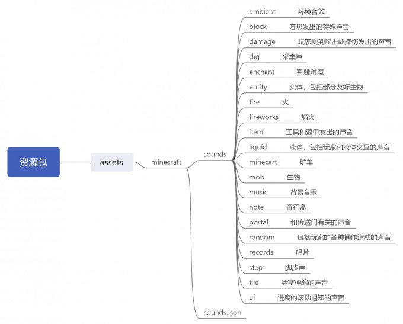
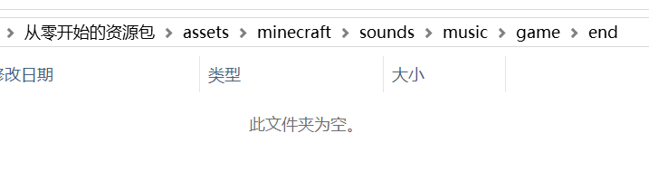
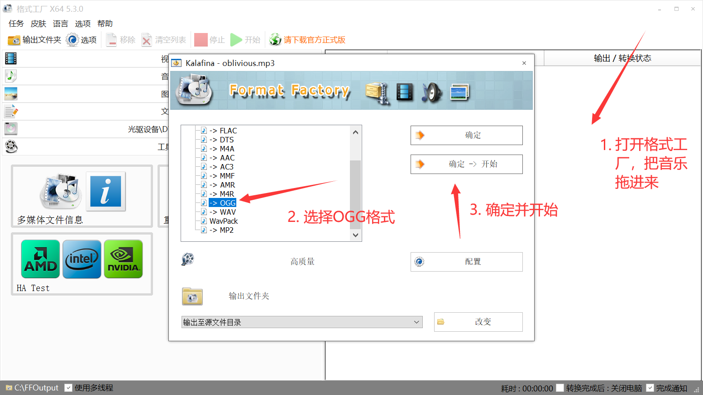
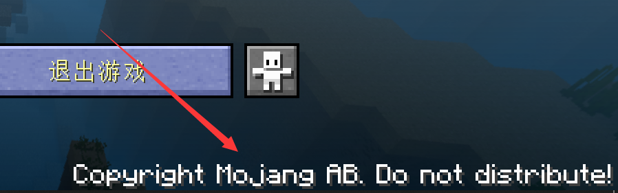
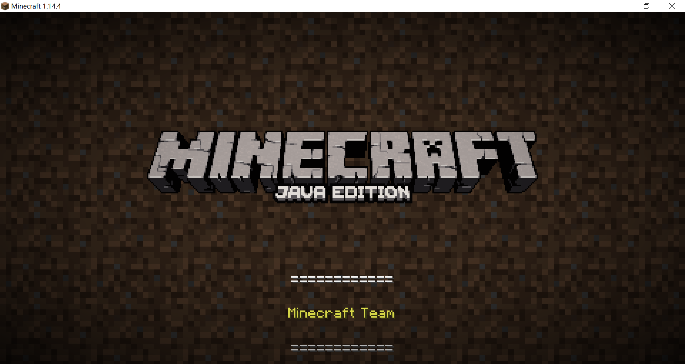

# 替换现有的音效

打开 Minecraft中文wiki 的[资源包模板](https://minecraft-zh.gamepedia.com/%E8%B5%84%E6%BA%90%E5%8C%85#.E8.B5.84.E6.BA.90.E5.8C.85.E6.A8.A1.E6.9D.BF)，这里展示了原版资源包真正的文件夹结构，由于音效文件数目实在是很多，看起来容易晕，我在这里列出不包含文件的文件夹层次：

::: tip 提示
原版音效试听：[音乐](https://minecraft-zh.gamepedia.com/%E9%9F%B3%E4%B9%90)，[环境音效](https://minecraft-zh.gamepedia.com/%E7%8E%AF%E5%A2%83%E9%9F%B3%E6%95%88)，[全部音轨](https://minecraft-zh.gamepedia.com/Category:%E9%9F%B3%E8%BD%A8)
:::

替换现有的音效的方法和制作普通的资源包没什么两样，如果你还不清楚原版的音效文件在哪，请看一下[这一节](../more-assets)。

这里简单做出一个示例：

我想把击杀末影龙后的显示的credits界面的背景音乐换掉。

1. 我估计credits界面的bgm所在的路径应该含有credits这个单词，于是我在1.15.json中搜索credits。

2. 现在我知道了这个音乐的路径，只需要按照这个路径在资源包里建立文件夹。

3. 文件夹建立好了，只需要放进新的credits.ogg就可以了，但一般情况下我们手头的音源不是ogg格式的，需要进行转换。我使用的转换工具是5.3.0版本的[格式工厂](http://www.pcfreetime.com/formatfactory/CN/index.html)（一些老版本转换出来的游戏可能读取不出来）。

4. 把转换好的音乐改名为credits.ogg，放进刚才创建的文件夹中。

这样我们的第一个音效就替换完成了！打开游戏试一下吧。

不知道有没有读者不知道右下角这里是可以点击的，点击后就能进入credits界面。

非常完美。（反正你们只能看到图片就听我描述吧）

::: danger 注意版权

在使用非自制的音源时，请一定要尊重作品的版权，未开放使用的音源请勿公开发布。

:::

## 相关视频

【Uncle Jam】Minecraft-如何替换音效！（资源包教程）

::: bv 1yk4y1q7Ln

:::

  <Vssue/>